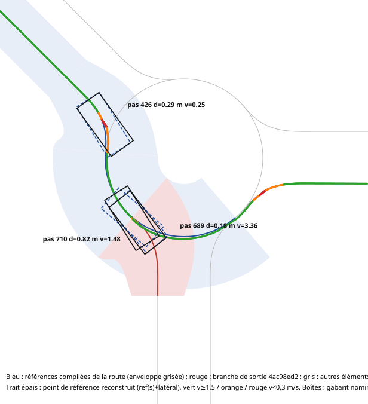
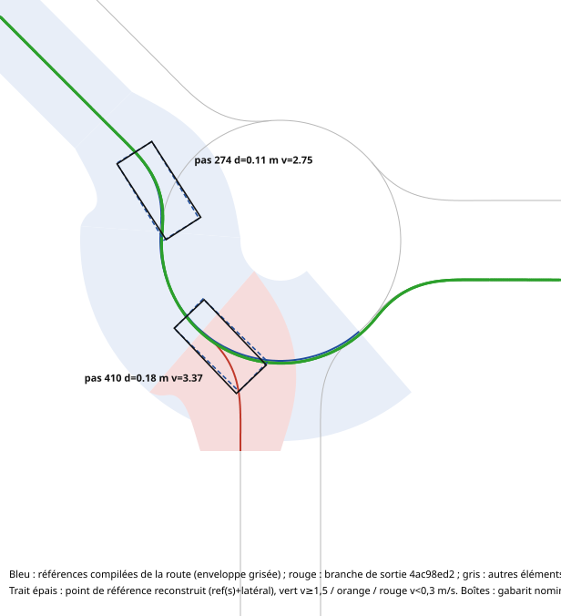

# Story 5.31 — diagnostic des ralentissements et des pics de d aux giratoires (2026-09-30)

Le diagnostic est une analyse hors ligne des campagnes existantes. Les correctifs A, B et C ont ensuite été décidés par le propriétaire, implémentés et mesurés (dernière section). Rien ici ne vaut acceptation. Aucune géométrie, aucun ε_t, aucune preuve ni signature Gate A n'ont été modifiés.

**Sources.** `exploratory-20260930-081217` (run 5, mouvement `469fe814…` et son passage complet au giratoire NW), recoupé avec `exploratory-20260930-095445` et `exploratory-20260930-093040`. Géométrie : `MVP_Run.road-model.json` (v4:e8dff9e5…). Profils : `DrivabilityProfile` (L = 3,10 m, a = 1,55 m, verrou 40° → 16° linéaire sur 0 → 26 m/s, direction inactive sous 0,25 m/s), `DriverProfileDef_Default` (DesiredSpeed 8, MaxAcceleration 1,5, ComfortableDeceleration 2, SafeBrakingLimit 4), `VehicleProfileDef_Default` (mêmes verrous, taux de braquage 300°/s).

**Reconstruction.** κ(s) est lu dans la référence compilée. Le braquage nominal est intégré par de/ds = κ − sin(e)/a et recoupe l'enregistrement (32,74° calculé contre 32,73° enregistré). L'angle commandé est recalculé avec la formule de `MotionCommand.Track`, et verrou(v) avec `VehicleSteeringModel.ResolveSteerAngleDegrees`. L'angle réellement appliqué aux roues et l'intention (gaz, frein) ne sont pas dans les traces enregistrées.

## Verdict

L'hypothèse initiale, « la trajectoire est correcte mais l'enveloppe vitesse/braquage force un ralentissement », est **partiellement vraie** et mélange **trois mécanismes distincts** :

| Famille | Symptôme | Où | Cause |
|---|---|---|---|
| A | Rampe à 0,25 m/s pendant ~3 s, d ≈ 0,39–0,45 m | les 24 mouvements d'entrée/sortie d'anneau | Géométrie saturée au rayon d'admission, `v*` calculé en régime établi, et `v*` minimal égal au seuil de direction |
| B | Freinage 3,4 → 1,4 m/s, d ≈ 0,82–0,88 m | Point de séparation de l'anneau (continuation contre sortie) | Bascule de localisation vers la branche de sortie, replanification parasite, repli, puis pose nominale héritée de la mauvaise branche |
| C | d = 6,54 m | 093040 run 1 | Même déclencheur que B, suivi d'un saut de progression de route sans nouvelle track de mesure |

**La vitesse n'est pas le problème sur l'anneau lui-même** : R = 6,00 m, `v*` = 12,85 m/s, `v/v*` ≤ 0,26, braquage commandé −30,5° pour un verrou disponible de 36,9°, sans saturation.

## Famille A — la rampe à 0,25 m/s

1. **Géométrie.** Les 24 mouvements d'entrée/sortie ont tous un rayon minimal de référence de **4,03 m**, soit *exactement* `RoadModelCompiler.AdmissionRadiusMeters` (verrou disponible à 0,25 m/s). `V1RoadModelImporter.BuildSmoothCurve` relie deux extrémités fixes, qui imposent une déviation de 49° sur 6,57 m, sous la contrainte κ_max ≤ 1/R_admission : la contrainte est active. La courbe est admise et reste dans ses enveloppes (voir la figure), mais son pic correspond à une manœuvre à plein braquage.
2. **`v*`.** `SteeringSpeedCeilingMetersPerSecond` exige le braquage de **régime établi** sur la courbure locale : 39,77° au pic, disponible seulement à v ≤ 0,25 m/s, donc `v*` = 0,25 m/s.
3. **Ce que la commande suit réellement.** La pose nominale cinématique (contrat §8) n'atteint pas le régime établi sur un pic aussi court :

| Mouvement | `v*` régime établi min | δ nominal max | v max par le verrou (δ nominal) | v max par le taux 300°/s | v à a_lat = 2 / 4 m/s² |
|---|---|---|---|---|---|
| Entrée `452ee31e` | **0,25** | 32,7° | 7,86 | 20,3 | 2,84 / 4,02 |
| Sortie `4ac98ed2` | **0,25** | 29,0° | 11,95 | 11,65 | 2,85 / 4,03 |

   La borne actuelle est donc environ 30 fois plus restrictive que l'exigence cinématique réelle. La limite physique pertinente est l'adhérence, entre 3 et 4 m/s, soit la `CurveLimit` que la 5.31 publie comme reportée à la 5.33.
4. **Effet aggravant.** `v*` minimal = 0,25 m/s = `MinimumDirectionSpeed`. Le suivi de vitesse arrive par en dessous, à 0,249 m/s. **74 % des pas de rampe se font direction désactivée** (3 404 pas, dont 2 530 inactifs en 081217 ; 2 351, dont 1 743, en 095445). Le véhicule ne tourne pas au point le plus serré : l'écart de cap au nominal atteint 5°, le latéral 0,17 m, et d monte jusqu'à 0,39–0,45 m. Ensuite, le braquage commandé sature à 40° pour rattraper. C'est la famille des pics d ≈ 0,43–0,45 m sur les 12 entrées.
5. **Anticipation correcte.** Le freinage démarre à ~4,8 m du pic, de 3,95 à 0,25 m/s à ≈ 1,6 m/s², par la passe arrière à la décélération de confort. Le plan freine tôt ; c'est la **cible** qui est dégénérée.

## Famille B — les pics 0,82–0,88 m

Les pics reproductibles `469fe814` (0,823 m), `4030253e` (0,881 m) et `453f130c` (0,853 m) ont la même séquence :

1. Le véhicule est stable sur l'anneau : d ≈ 0,17 m, v ≈ 3,3 m/s, e = −14,97°, ce qui correspond au régime établi pour R = 6 m.
2. Au point de séparation, `RoadLocalizer` retient la **branche de sortie**. Le terme de cap du score (2 m × |cap|/180) compare le cap de la caisse à la tangente, alors que sur l'anneau la caisse est structurellement tournée de asin(a/R) = 14,97° vers l'extérieur. La sortie, qui tourne à droite, « ressemble » mieux. Le bonus de route ne vaut que 0,05 m.

| u après le split | marge de la branche anneau (m), précédent = corridor d'anneau |
|---|---|
| 0,00 | +0,044 |
| 0,42 | +0,014 |
| 0,63 | +0,001 |
| 0,83 | **−0,004** |
| 1,25 | +0,158 |

   Ces marges valent pour un véhicule idéal ; 1–2° de lacet ou quelques centimètres vers l'extérieur suffisent à basculer.
3. `TryReuse` échoue, ce qui produit une replanification sur la sortie. `v*` y tombe à 0,25 m/s 2 m plus loin : le résultat est `SteeringCeilingUnreachable`, puis un refus du vérificateur, puis le **repli à `SafeBrakingLimit`** pendant 16 pas (3,26 → 1,48 m/s).
4. La localisation revient sur l'anneau et une nouvelle track démarre. Elle **hérite de l'écart e ≈ 0° intégré le long de la branche de sortie**, alors que la caisse est correctement à 17° sur l'anneau. Résultat : d = 0,82 m, avec un latéral physique de seulement **0,079 m**. d décroît ensuite sur ~6 m, pendant que e relaxe vers −15°.

Le pic de d est donc surtout un artefact de référence de mesure. En revanche, **le freinage est physique** : c'est le second ralentissement visible au giratoire.

## Famille C — le cas 6,54 m (à ne pas utiliser pour régler la physique)

Le début est identique à B (bascule au pas 690). Au pas 710, la localisation revient sur l'anneau, mais `TryReuse` trouve une occurrence **ultérieure** de l'anneau dans le plan de sortie (retour de giratoire) et la traite comme une progression. Le driver adopte ce plan **sans nouvelle track de mesure** (`TrafficV2VehicleDriver.cs`, branche `else route = decision.Route.Plan`). Deux conséquences :

- d reste mesuré contre la branche de sortie et croît avec la divergence des branches, jusqu'à 6,54 m ;
- la commande prend son anticipation dans la pose nominale de la track de sortie (+14°, à droite) alors qu'elle corrige contre l'anneau (à gauche). Le véhicule élargit physiquement jusqu'à **0,92 m** de latéral.

## Réponse aux huit pistes

| Piste | Verdict |
|---|---|
| 1. Géométrie / `JunctionMovement` | **En cause (famille A).** Les courbes sont cohérentes et dans leurs enveloppes, mais leur pic est saturé au rayon d'admission. |
| 2. `SpeedPlan` | Hors de cause. Il respecte `v*` et anticipe à la décélération de confort. Observabilité : `binding` du plan = point 0, presque toujours `MaxAcceleration` ; seul `v/v*` montre la contrainte liante. |
| 3. Plafond `v*` | **En cause (famille A).** Calculé en régime établi, il est trop conservateur face à la pose nominale suivie, et son minimum coïncide avec le seuil de direction. |
| 4. Relation vitesse → verrou | **Hors de cause.** Aux vitesses d'adhérence réalistes (3–4,6 m/s), le verrou disponible est de 35,8–36,8°, au-delà de tout δ nominal du réseau (≤ 32,7°). Aucune loi ne peut rendre 39,77° « disponible en roulant » : c'est 99,4 % du verrou mécanique. |
| 5. Anticipation | Hors de cause. |
| 6. Commande de direction | Correcte ; elle sature à 40° pour rattraper l'écart accumulé pendant la direction inactive (A), et elle est faussée par la pose nominale périmée (C). |
| 7. Pneus / Rigidbody | Hors de cause dans les données : suivi de 0,05–0,2 m sur l'anneau. |
| 8. Combinaison | Oui : A = géométrie × `v*` × seuil de direction ; B et C = localisation × replanification × pose nominale. |

## Ligne de base AVANT (081217, run 5)

| élément | pas | durée (s) | v min | v moy | d max | latéral max | écart cap/nominal max | δ nominal max | pas direction inactive | pas δ commandé saturé | pas en repli | max v/v* |
|---|---|---|---|---|---|---|---|---|---|---|---|---|
| entrée `452ee31e` | 332 | 6,64 | 0,24 | 0,99 | 0,393 | 0,174 | 5,1° | 32,7° | 100 | 213 | 0 | 0,995 |
| corridor anneau `4ec40e5f` | 105 | 2,10 | 1,42 | 2,60 | 0,231 | 0,142 | 2,6° | 26,7° | 0 | 0 | 0 | 0,259 |
| anneau `469fe814` | 162 | 3,24 | 1,39 | 2,28 | 0,823 | 0,199 | 17,4° (artefact) | 27,8° | 0 | 0 | 0 | 0,261 |
| sortie parasite `4ac98ed2` | 20 | 0,40 | 1,57 | 2,49 | 0,788 | — | — | 27,2° | 0 | 0 | 20 | 0,863 |

Sortie atteinte : oui. `v > v*` : 0 pas.

## Figure

- En bleu, les références compilées de la route, avec leur enveloppe. En rouge, la branche de sortie parasite.
- Le trait épais est le point de référence reconstruit, ref(s) + latéral, coloré selon la vitesse.
- Les boîtes montrent le gabarit nominal (tirets) et le gabarit physique (trait plein) aux pas 426 (rampe), 689 (anneau stable) et 710 (pic après replanification).

## Correctifs appliqués et mesure AVANT / APRÈS

**Décisions du propriétaire (2026-09-30).**

- A : `v*` calculé depuis la pose nominale, et limite de courbe avancée de la 5.33.
- B : localisation comparant le cap à l'orientation nominale du candidat, avec bonus de route égal à `ScoreBandMeters`.
- C : progression de route contiguë.

Le détail est dans le Spec Change Log de la 5.31.

**Validation officielle.**

- `validate.ps1 -Profile Story -Story 5.31 -TestMode EditMode` : 49/49, 0 erreur Console.
- Rejeu ciblé `[Explicit]` `Story531Roundabout` : 1/1, 0 erreur Console. Il produit `exploratory-20260930-122303`, qui rejoue les triplets 5, 7, 9 et 10 de `exploratory-20260930-081217`, aux mêmes entrée, sortie, via et graine.

**Par route** (runs 5, 7, 9, 10 → 0, 1, 2, 3) :

| Route | Temps | Références (replans + 1) | Pas en repli | d max |
|---|---|---|---|---|
| 5 → 0 | 68,2 → 43,5 s | 3 → 1 | 21 → 1 | 0,823 → 0,328 m |
| 7 → 1 | 90,5 → 59,5 s | 4 → 1 | 36 → 1 | 0,823 → 0,328 m |
| 9 → 2 | 90,6 → 59,6 s | 4 → 1 | 37 → 1 | 0,881 → 0,328 m |
| 10 → 3 | 113,4 → 72,1 s | 5 → 1 | 63 → 1 | 0,853 → 0,327 m |

Après correction, l'unique pas « en repli » de chaque route est `ExitPortalReached`, le dernier pas sur le portail de sortie. Les 4 sorties sont atteintes. On compte 0 pas au-dessus de `v*`, 0 intervalle `ModelNotVerified`, 0 `NominalPoseInfeasible` et 0 couple négatif. Les contacts observés sont 4 contacts de dos d'âne roulable reconnu, sans critère déclenché.

**Entrée NW `452ee31e`** (runs 5 → 0, identique pour 7 → 1) :

| | AVANT | APRÈS |
|---|---|---|
| v min / v moyenne | 0,24 / 0,99 m/s | 2,68 / 3,27 m/s |
| temps dans le mouvement | 6,64 s | 2,00 s |
| braquage nominal requis max | 32,7° | 32,7° |
| verrou disponible min | 0° (direction inactive) | 35,7° |
| braquage commandé / appliqué max | 40° (saturé) / non enregistré | 36,3° / 36,3° |
| pas saturés / pas direction inactive | 213 / 100 | 0 / 0 |
| d max / latéral max / écart de cap au nominal max | 0,393 m / 0,174 m / 5,1° | 0,164 m / 0,077 m / 2,0° |
| replis | 0 | 0 |
| max v/v* (v* du run) | 0,995 | 0,342 |
| contrainte limitante | — | `CurveLimit` |

Au pic, v dépasse l'ancien plafond de régime établi (0,25 m/s) d'un facteur 10,9. C'est voulu : ce plafond ne régit plus la conduite (décision A).

**Par catégorie de mouvement, sur les 4 routes :**

| Catégorie | R min | v min AVANT → APRÈS | d max AVANT → APRÈS | Remarques |
|---|---|---|---|---|
| entrées d'anneau (6 types) | 4,03 m | 0,24 → 2,68 m/s | 0,39–0,44 → 0,164–0,166 m | rampe supprimée |
| sorties d'anneau (7 types) | 4,03 m | 0,16 → 2,79 m/s | 0,15–0,17 → 0,155–0,180 m | durée 6,9 → 2,1 s |
| continuations d'anneau | 6,00 m | 1,2–2,0 → 3,2–3,4 m/s | 0,19–0,82 → 0,17–0,20 m | replis 15–20 → 0 |
| sorties parasites (`4ac98ed2`, `4030253e`, `453f130c`) | — | disparues | 0,79–0,88 m → — | aucune bascule |
| tourne-à-gauche (8 types) | 7,01 m | 6,0–6,5 → 3,69 m/s | 0,31–0,36 → 0,159–0,160 m | trop rapides avant (5 m/s² latéral) |
| tout droit | — | 6,1–6,5 → 6,5–6,6 m/s | 0,005 → 0,006–0,008 m | haute vitesse inchangée |
| **tourne-à-droite (4 types)** | **4,21 m** | **1,60 → 2,50 m/s** | **0,185–0,189 → 0,327–0,328 m** | **régression, voir ci-dessous** |

**Régression sur les tourne-à-droite serrés.** Le braquage nominal atteint 35,4°. À 2,5–2,6 m/s, le verrou disponible est de 37,6°, soit une réserve de 2,2°. Le cap de la caisse dérive dès l'entrée du virage (jusqu'à −2,1° avant toute saturation) : la caisse tourne moins que le modèle cinématique. Le glissement de pneu n'explique pas cet écart (environ 0,4° estimé avec μ = 3) ; la piste est la direction parallèle sans Ackermann déjà notée au Spec Change Log du 2026-09-29. La commande sature alors à 40°, avec 37,66° appliqués (le verrou disponible), et le véhicule s'élargit de 0,18 m vers l'extérieur. Il reste dans sa voie, avec 0,78 m de marge au bord.

Ces virages saturaient déjà avant, sur 54 pas à 1,6 m/s. Aucune vitesse ne rend la réserve suffisante : il faudrait 4,6° de réserve pour ne pas saturer, et le braquage nominal (35,4°) plus 4,6° atteint déjà 40°, le braquage à l'arrêt. La vitesse module seulement la dérive, via la réduction du verrou de 0,92° par m/s. La décision appartient au propriétaire : accepter, ajouter une réserve de braquage déclarée au plafond, ou traiter la physique ou la géométrie.

**Coût.** Le coût de l'étape « route+horizon+mouvement » est passé d'environ 1,1 ms à 3,5–5,8 ms en moyenne dans ce rejeu. En cause, `RoadCurve.AdvanceKinematicOffset` rebalayait tous les échantillons à chaque point de l'horizon, soit un coût quadratique : un mouvement porte environ 230 échantillons. La correction (recherche binaire `Locate` et arrêt au-delà de s1) donne un résultat identique bit à bit et a été revalidée en EditMode (49/49). Le nouveau coût n'a pas été re-mesuré en PlayMode.

Le giratoire NW après correctifs (run 0, même route que le run 5 avant) : vitesse partout au-dessus de 1,5 m/s, et gabarits nominal et physique confondus au pic d'entrée (pas 274, d = 0,11 m) comme au split (pas 410, d = 0,18 m).

## Coût par étape re-mesuré après redémarrage de l'Éditeur (`exploratory-20260930-131613`)

Rejeu `Story531Roundabout` sur le code final, Éditeur redémarré : 1/1, 0 erreur Console. Même nombre de pas qu'en `122303` (2177 / 2977 / 2978 / 3604), 0 replanification, 1 repli par run (`ExitPortalReached`), d max 0,3274–0,3284 m (écart ≤ 2e-5 m avec `122303`), 0 pas v > v*, 0 `ModelNotVerified`, 0 `NominalPoseInfeasible`, aucun contact bloquant.

| triplet | route+horizon moy. AVANT `081217` | avant correctif `122303` | APRÈS `131613` | max AVANT / APRÈS | total route+horizon par trajet AVANT / APRÈS | plan de vitesse moy. AVANT / APRÈS |
|---|---|---|---|---|---|---|
| 5 | 0,767 ms | 3,550 ms | 1,061 ms | 18,0 / 8,7 ms | 2,62 / 2,31 s | 1,200 / 1,221 ms |
| 7 | 1,075 ms | 5,205 ms | 1,522 ms | 22,4 / 9,9 ms | 4,86 / 4,53 s | 1,720 / 1,824 ms |
| 9 | 1,068 ms | 4,849 ms | 1,426 ms | 17,9 / 15,2 ms | 4,84 / 4,25 s | 1,739 / 1,682 ms |
| 10 | 1,100 ms | 5,791 ms | 1,671 ms | 13,9 / 14,6 ms | 6,24 / 6,02 s | 1,832 / 2,009 ms |

Le correctif de coût retire 88 à 91 % du surcoût mesuré en `122303`. Il reste +33 à +52 % par pas contre AVANT, soit le transport de e sur chaque point de l'horizon et les ancres de la localisation. Le coût total par trajet baisse de 4 à 12 % parce que les trajets sont plus courts. Le pic par pas baisse sur trois triplets sur quatre. Le seuil fixé au plan (moyenne ≤ 1,66 ms, soit la plus haute moyenne enregistrée avant A / B / C) est dépassé de 0,011 ms sur le triplet 10.

## Campagne exploratoire complète sur le code corrigé (`exploratory-20260930-133627`)

Lancée par `validate.ps1 -TestMode PlayMode -TestFilter Story531Campaign -TestFilterType category -IncludeExplicit` après redémarrage de l'Éditeur. Résultat brut : 5/6 tests passés, 1 inconclusive (`AcceptanceCampaignVerifiesTheDeclaredTolerance` : epsilon_t non déclaré, attendu), 0 erreur Console. `validate.ps1` conclut `VALIDATION FAILED / INCOMPLETE` parce qu'il compte l'inconclusive comme échec (AD-8). Les cinq campagnes produites par la catégorie sont `133332` (Missing), `133627` (exploratoire complète), `134845` (Contact), `135653` (Targeted) et `140448` (Roundabout, identique à `131613`).

**Bilan global, AVANT `081217` → APRÈS `133627`, mêmes 11 triplets :**

| critère | AVANT | APRÈS |
|---|---|---|
| sorties atteintes | 11/11 | 11/11 |
| éléments Measured / NotMeasured | 161 / 3 | **164 / 0** |
| pas totaux du résumé (temps simulé) | 53 347 (1 067 s) | **36 604 (732 s)** |
| replanifications | 21 | **0** |
| pas en repli (dont `ExitPortalReached`) | 299 (11) | **11 (11)** |
| d max au pas / borne entre deux pas | 0,8806 / 0,9086 m | **0,3296 / 0,3305 m** |
| pas v > v*, `ModelNotVerified`, `NominalPoseInfeasible`, couple de repli négatif | 0, 0, 0, 0 | 0, 0, 0, 0 |
| contacts (dont avec critère) | 10 (4) | 10 (4) |

**Par run :**

| run | pas AVANT / APRÈS | replans | replis | d max (m) | route+horizon moy. (ms) | max (ms) | total route+horizon (s) | plan de vitesse moy. (ms) |
|---|---|---|---|---|---|---|---|---|
| 0 | 6427 / 4451 | 0 / 0 | 31 / 1 | 0,435 / 0,328 | 1,532 / 2,283 | 13,6 / 15,7 | 9,85 / 10,16 | 2,57 / 2,66 |
| 1 | 5704 / 3683 | 1 / 0 | 1 / 1 | 0,616 / 0,330 | 1,404 / 2,083 | 13,0 / 19,0 | 8,01 / 7,67 | 2,30 / 2,39 |
| 2 | 4816 / 2633 | 2 / 0 | 21 / 1 | 0,822 / 0,197 | 1,128 / 1,642 | 24,6 / 14,2 | 5,43 / 4,32 | 1,79 / 1,90 |
| 3 | 4514 / 2862 | 3 / 0 | 35 / 1 | 0,822 / 0,328 | 1,060 / 1,605 | 22,3 / 14,6 | 4,78 / 4,59 | 1,73 / 1,86 |
| 4 | 3087 / 3948 | 2 / 0 | 20 / 1 | 0,620 / 0,327 | 1,056 / 2,046 | 13,2 / 19,2 | 3,26 / 8,08 | 1,73 / 2,40 |
| 5 | 3410 / 2177 | 2 / 0 | 21 / 1 | 0,823 / 0,328 | 0,767 / 1,094 | 18,0 / 11,6 | 2,62 / 2,38 | 1,20 / 1,25 |
| 6 | 5096 / 3732 | 0 / 0 | 18 / 1 | 0,393 / 0,328 | 1,220 / 1,806 | 12,8 / 16,0 | 6,22 / 6,74 | 2,02 / 2,11 |
| 7 | 4524 / 2977 | 3 / 0 | 36 / 1 | 0,823 / 0,328 | 1,075 / 1,603 | 22,4 / 14,9 | 4,86 / 4,77 | 1,72 / 1,88 |
| 8 | 5552 / 3542 | 1 / 0 | 16 / 1 | 0,603 / 0,328 | 1,308 / 1,959 | 12,9 / 15,6 | 7,26 / 6,94 | 2,17 / 2,25 |
| 9 | 4529 / 2978 | 3 / 0 | 37 / 1 | 0,881 / 0,328 | 1,068 / 1,491 | 17,9 / 14,1 | 4,84 / 4,44 | 1,74 / 1,73 |
| 10 | 5671 / 3604 | 4 / 0 | 63 / 1 | 0,853 / 0,327 | 1,100 / 1,770 | 13,9 / 15,1 | 6,24 / 6,38 | 1,83 / 2,06 |

Le run 4 est plus long parce qu'il passe désormais par son mouvement objectif `40ca7f10` (TJunction_West, depuis l'est, tout droit) : 35 éléments et environ 329 m, contre 18 éléments et 183 m AVANT. AVANT, une replanification abandonnait cet objectif ; c'est l'origine des 3 éléments `NotMeasured`.

**Par catégorie de mouvement (passages contigus, AVANT → APRÈS) :**

| catégorie | passages | v min (m/s) | v moy. (m/s) | durée moy. (s) | d max (m) | latéral max (m) | cap/nominal max | pas saturés | pas direction inactive | pas en repli |
|---|---|---|---|---|---|---|---|---|---|---|
| entrée d'anneau | 35 / 37 | 0,23 / 2,68 | 0,98 / 3,30 | 6,68 / 1,98 | 0,452 / 0,166 | 0,210 / 0,079 | 5,8° / 2,1° | 7674 / 0 | 3660 / 0 | 0 / 0 |
| sortie d'anneau | 41 / 37 | 0,15 / 2,73 | 1,16 / 3,05 | 5,90 / 2,11 | 0,881 / 0,180 | 0,266 / 0,130 | 10,9° / 2,7° | 3859 / 0 | 3346 / 0 | 144 / 0 |
| continuation d'anneau | 27 / 21 | 1,21 / 3,23 | 2,73 / 3,37 | 2,36 / 2,49 | 0,823 / 0,197 | 0,199 / 0,130 | 17,4° / 2,2° | 0 / 0 | 0 / 0 | 144 / 0 |
| T, gauche (R = 7,01 m) | 16 / 19 | 6,03 / 3,69 | 6,66 / 4,23 | 2,34 / 3,89 | 0,374 / 0,160 | 0,331 / 0,112 | 2,1° / 1,3° | 0 / 0 | 0 / 0 | 0 / 0 |
| carrefour central, gauche | 3 / 4 | 6,11 / 3,69 | 6,69 / 4,23 | 2,31 / 3,89 | 0,361 / 0,160 | 0,317 / 0,112 | 2,1° / 1,3° | 0 / 0 | 0 / 0 | 0 / 0 |
| T, droite (R = 4,21 m) | 12 / 9 | 1,60 / 2,50 | 2,27 / 2,94 | 4,27 / 3,31 | 0,189 / 0,330 | 0,086 / 0,189 | 2,4° / 3,4° | 658 / 541 | 0 / 0 | 0 / 0 |
| carrefour central, droite | 5 / 5 | 1,60 / 2,50 | 2,27 / 2,93 | 4,26 / 3,32 | 0,188 / 0,328 | 0,085 / 0,186 | 2,4° / 3,4° | 270 / 300 | 0 / 0 | 0 / 0 |
| T, tout droit | 15 / 12 | 6,22 / 6,48 | 6,85 / 7,17 | 1,73 / 2,23 | 0,620 / 0,008 | 0,218 / 0,002 | 13,8° / 0,1° | 5 / 0 | 0 / 0 | 0 / 0 |
| carrefour central, tout droit | 7 / 5 | 6,27 / 6,42 | 7,24 / 7,34 | 1,96 / 2,18 | 0,603 / 0,051 | 0,211 / 0,004 | 13,3° / 0,0° | 1 / 0 | 0 / 0 | 0 / 0 |

Les tourne-à-droite serrés restent la seule catégorie dégradée, conformément au choix 1. Le d max de la campagne (0,3296 m) est atteint sur `4a7f0085` (run 1). Les « tout droit » AVANT à 0,60 m et 13° venaient des bascules de localisation, pas de la conduite.

**Coût par étape.** Sur la campagne complète, route+horizon+mouvement vaut 1,09 à 2,28 ms par pas en moyenne, soit 1,39 à 1,94 fois AVANT. Six runs sur onze dépassent 1,66 ms. Le coût total de route+horizon sur la campagne passe de 63,4 à 66,5 s (+5 %) malgré 31 % de pas en moins. Hors run 4, dont la route s'est allongée, il passe de 60,1 à 58,4 s (-3 %). Le pire pas baisse (24,6 → 19,2 ms). Les runs rapides sur les avenues coûtent le plus, ce qui est cohérent avec un coût proportionnel à la longueur de l'horizon, où e est transporté point par point. Le plan de vitesse est à peu près inchangé (+0 à +10 %, +39 % au run 4 sur une route plus longue). Le rejeu ciblé `131613` ne voyait que des routes lentes : il sous-estimait le surcoût.

**Contacts.** Mêmes quatre lignes `OutOfBounds(OutsideEnvelope)` qu'AVANT, sur le dos-d'âne (`Rampe_Ouest` / `Rampe_Est`, runs 3 et 6), déjà expliquées par `Story531Contact`. Il y a un choc dur nouveau dans cette campagne sur la marche basse de 0,12 m (`Relief_MarcheBasse_AvenueCenterToEast`, run 6, pas 1087) :
- impulsion 8312 N·s, v 7,52 → 0,57 m/s en un pas ;
- en ligne droite (`43cf13ae`), écart latéral 0, sans freinage (`DesiredSpeed`) ;
- aucun critère de conséquence, sortie atteinte.

Ce phénomène existait avant A / B / C : `073623` run 7, même marche, 6,88 → 2,60 m/s, 5105 N·s, critères `OutOfBounds,LossOfControl`. Il dépend de la phase de la suspension à l'arrivée sur l'arête de la marche, pas de la direction ni du plan de vitesse. `deferred-work.md` prévoit déjà le retrait de ce relief « si sa présence fausse une mesure de trafic IA ».
