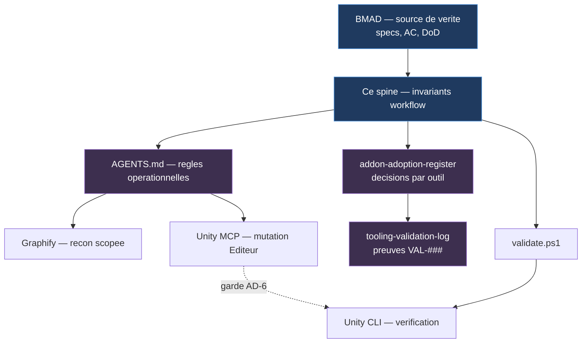
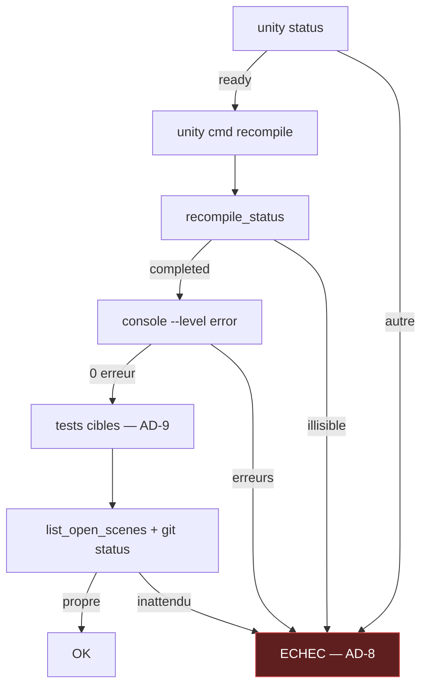

# Architecture Spine — Workflow de developpement IA

Ce spine gouverne **comment RoadRage Simulator est construit**, pas ce qui est construit.
L'architecture du jeu reste `architecture-RoadRage_Simulator-2026-09-02/ARCHITECTURE-SPINE.md`
(altitude feature, 34 AD), **read-only depuis ici** : aucun AD d'outillage n'y est ajoute.

## Design Paradigm

**Recon scopee → execution gardee → verification deterministe pilotee par l'humain.**

Trois etages, chacun avec sa regle de sortie :

| Etage | Principe | Regle de sortie |
| --- | --- | --- |
| **Recon** | Le graphe ne contient que du code applicatif ; un symbole nomme est prouve avant d'etre interroge | Aucune ligne `Assets/RoadRage` = echec, pas reponse |
| **Execution** | Toute mutation d'etat Editeur est encadree par une double garde avant/apres | Etat inattendu = STOP, main rendue |
| **Verification** | Deterministe, sur Editeur connecte, declenchee par l'utilisateur | Absence de resultat = echec, jamais succes |

Le fil conducteur : **un agent ne valide jamais son propre travail par un moyen qu'il controle.**

## Invariants & Rules

### AD-1 — BMAD est la source de verite unique [ADOPTED]

- **Binds :** toute session agent
- **Prevents :** qu'un outil de recon, un registre ou un rapport d'audit devienne une seconde autorite sur le scope, les AC ou la DoD
- **Rule :** aucun artefact d'outillage ne peut contredire un spec BMAD. En cas de divergence, le spec gagne et l'artefact est corrige.

### AD-2 — Graphify n'indexe que le code applicatif

- **Binds :** perimetre de recon de toute session
- **Prevents :** un corpus majoritairement compose d'outillage, qui repousse le graphe au-dela de sa limite utile et degrade la qualite des reponses
- **Rule :** `.graphifyignore` a la racine fait foi. `.agents/`, `.claude/`, `.codex/`, `_bmad/`, `_bmad-output/`, `graphify-out/` et `Assets/Synty/` restent exclus.

### AD-3 — Un symbole nomme est prouve avant d'etre interroge

- **Binds :** toute recon
- **Prevents :** qu'un agent agisse sur une reponse fabriquee pour un symbole inexistant
- **Rule :** `rg "\bSymbole\b" Assets/RoadRage -g "*.cs"` d'abord ; absent → **STOP**, sans interroger Graphify. Pas de precheck pour les questions macro sans symbole nomme. Une sortie sans aucune ligne `Assets/RoadRage` est un echec de resolution, jamais une reponse.

### AD-4 — La verification est declenchee par l'utilisateur, jamais par l'agent [ADOPTED]

- **Binds :** compilation, tests, analyzers, audit
- **Prevents :** qu'un agent declare une story terminee sur une verification qu'il a lui-meme simulee ou contournee
- **Rule :** l'agent demande l'execution de `scripts/validate.ps1` et consomme la sortie fournie. Il n'execute aucune commande de verification. Herite de `_bmad/custom/bmad-build.toml`.

### AD-5 — La validation passe par l'Editeur connecte, jamais par le batchmode

- **Binds :** `validate.ps1` et tout controle Unity automatise
- **Prevents :** qu'un second Editeur tente d'ouvrir un projet deja verrouille par la session de travail
- **Rule :** `unity status` doit renvoyer `ready` pour RRS. Les controles passent par `unity cmd` (`recompile`, `console`, `run_tests`, `list_open_scenes`). `unity run` et `unity build` sont hors du chemin de validation.

### AD-6 — Double garde d'etat avant et apres toute operation Unity MCP

- **Binds :** scenes, prefabs, assets, Inspector
- **Prevents :** la perte silencieuse d'un objet committe quand l'etat memoire de l'Editeur diverge du disque — **incident reellement survenu** sur `Dev_VehicleSandbox` (VAL-027)
- **Rule :** « significative » = **toute commande hors de l'allowlist lecture seule** (`status`, `list_open_scenes`, `list_tests`, `console`, `recompile_status`, `audit_status`, `get_scene_hierarchy`, `find_gameobjects`). Pour celles-la : `git status --short` **et** `unity cmd list_open_scenes` avant. Etat inattendu → STOP, main rendue. Jamais de sauvegarde d'une scene dont l'etat `isDirty` n'est pas explique. Reverification des deux apres.

### AD-7 — Le gate porte sur les erreurs ; les avertissements sont filtres par origine

- **Binds :** lecture de la Console Unity
- **Prevents :** qu'un diagnostic utile issu de `Assets/RoadRage` soit noye sous 500+ avertissements d'assets tiers — ou qu'un masquage global le supprime
- **Rule :** gate sur `--level error`. Les warnings sont lus en excluant `Assets/Synty/`, sans desactivation globale.

### AD-8 — `validate.ps1` echoue ferme

- **Binds :** chaque etape du script
- **Prevents :** qu'une panne d'outillage soit interpretee comme une validation reussie
- **Rule :** `status` different de `ready`, CLI muet, commande inconnue, timeout, `recompile_status` ou `test_status` illisible → echec explicite. **Un test en echec est un echec** — seul un `test_status` lisible rapportant zero test echoue vaut succes. **Une absence de resultat n'est jamais un succes.**

### AD-9 — La suite de tests est choisie selon la nature du changement

- **Binds :** etape de test de chaque story
- **Prevents :** a la fois le cout d'une suite complete systematique et l'angle mort d'un EditMode seul sur du code runtime
- **Rule :** **EditMode** pour la logique pure, la validation de donnees, les calculs, les ScriptableObjects hors runtime. **PlayMode** des qu'une story touche RPC, host/client, ownership, NetworkVariable runtime, spawn/despawn, GameObjects, scenes, prefabs runtime, cycle de vie MonoBehaviour, coroutines, timing/frame, physique, collisions, controleurs vehicule, interactions entre composants, ou IA dependant du runtime. Le reseau implique PlayMode mais n'en est pas la seule raison. **En cas de doute sur le classement d'un changement, PlayMode.**

### AD-10 — Aucun reviewer LLM n'est empile par defaut

- **Binds :** etape de revue
- **Prevents :** cinq passes LLM sur le meme diff (3 couches `bmad-build` + `code-review` + `simplify`) pour un gain marginal
- **Rule :** les 3 couches de `bmad-build` suffisent par defaut. `security-review` seulement si la story deplace une **frontiere de confiance reseau** : RPC appelable par un client, validation de `SenderClientId`, ownership, permissions `NetworkVariable`, donnees controlables par le client. Modifier une `NetworkVariable` sans changer de frontiere ne suffit pas.

### AD-11 — Chaque client agent garde sa propre declaration MCP

- **Binds :** configuration MCP
- **Prevents :** qu'une consolidation dans un fichier unique prive Codex, VS Code ou Claude Desktop de leurs serveurs
- **Rule :** une declaration est retiree **uniquement du client ou elle est inutile ou cassee**. Pas de fichier de configuration MCP unifie.

### AD-12 — Les dossiers de skills dupliques restent en place

- **Binds :** `.agents/skills`, `.claude/skills`, `.codex/skills`
- **Prevents :** la suppression d'un dossier consomme par un autre agent que Claude Code
- **Rule :** exclure de Graphify, ne pas supprimer. `.agents/skills` est la convention `AGENTS.md` et est consomme par Codex ; `skills-lock.json` en pilote le vendoring.

### AD-13 — Un outil n'entre qu'avec un besoin mesure, un pilote et un rollback ecrit

- **Binds :** toute proposition d'ajout d'outil
- **Prevents :** l'empilement d'outils justifies par leur popularite ou leur liste de fonctionnalites plutot que par un trou constate dans ce repo
- **Rule :** une ligne `ADDON-###` dans `docs/setup/addon-adoption-register.md` porte la decision, le declencheur de reevaluation et le cout de rollback **avant** toute installation. La regle vaut aussi pour un outil **deja en place** : le stack existant est enregistre retroactivement, un outil sans ligne ne peut pas etre invoque comme precedent.

### AD-14 — Les `.csproj` generes ne sont jamais une configuration persistante

- **Binds :** integration d'analyzers
- **Prevents :** qu'une configuration soit ecrasee a la prochaine regeneration des fichiers projet par Unity
- **Rule :** la configuration d'analyzers passe par `.editorconfig` et par des assets etiquetes dans le projet, jamais par edition des `.csproj`.

### Direction des dependances



Aucune fleche ne remonte vers BMAD : rien dans l'outillage ne peut redefinir un spec (AD-1).

## Consistency Conventions

| Concern | Convention |
| --- | --- |
| Identifiants de decision | `AD-n` ici (workflow) ; `ADDON-###` par outil ; `VAL-###` par preuve. Jamais renumerotes ni reutilises. |
| Langue | Ce spine et `AGENTS.md` suivent `document_output_language` (francais). Le spine jeu reste en anglais — divergence connue, non tranchee. |
| Sections `AGENTS.md` | Toute regle durable vit **hors** du bloc `<!-- bmad:context -->`, sinon elle est ecrasee au refresh de `bmad-project-context`. |
| Preuve d'une mesure | Chiffre + commande ou chemin reproductible. Une mesure sans commande rejouable est une hypothese, marquee comme telle. |
| Versions d'outillage | Epinglees et revalidees separement. Unity CLI `1.0.0-beta.8` est la reference ; aucune montee automatique. |
| Rebuild du graphe | Automatique via le hook `post-commit` existant, qui respecte `.graphifyignore`. |

## Stack

| Name | Version |
| --- | --- |
| Unity Editor | 6000.6.0f1 |
| Unity CLI | 1.0.0-beta.8 |
| Unity MCP (officiel, `com.unity.ai.assistant`) | relay `relay_win.exe`, 54 outils |
| Netcode for GameObjects | 2.13.2 |
| Unity Test Framework | 1.8.0 |
| BMAD | 6.11.0 |
| Graphify | uv tool `graphifyy` |
| Plugins Claude Code | `unity@unity-agent-plugin`, `ponytail@ponytail` |

## Structural Seed

```text
RRS/
  .graphifyignore          # AD-2 — perimetre du graphe
  AGENTS.md                # AD-3, AD-6 — regles operationnelles (hors bloc bmad:context)
  scripts/
    validate.ps1           # AD-4, AD-5, AD-7, AD-8 — chaine de verification
  docs/setup/
    addon-adoption-register.md   # AD-13 — decision par outil
    tooling-validation-log.md    # preuves VAL-###
  _bmad-output/planning-artifacts/architecture/
    architecture-RoadRage_Simulator-2026-09-02/   # spine JEU — read-only depuis ici
    architecture-RRS-devworkflow-2026-09-17/      # ce spine
```

### Chaine de verification



## Deferred

| Sujet | Raison de l'attente | Condition de revisite |
| --- | --- | --- |
| **Serena** | Graphify scope couvre la recon ; le cout de navigation n'est pas mesure comme dominant | Sur plusieurs stories M/L, si la recherche de references reste un poste dominant en tokens/temps malgre AD-2 et AD-3 |
| **RTK** | Aucune telemetrie sur la part des tokens issue du shell | Une mesure reelle ; gain plausible = part shell x compression reelle |
| **jscpd** | Une passe ponctuelle suffit a obtenir le signal — la duplication trouvee (garde d'autorite x5) l'a ete sans l'outil | Si la duplication devient un probleme recurrent constate en revue |
| **Roslynator** | Compilateur, analyzers Unity, Project Auditor, revue BMAD, ponytail et 533 tests couvrent deja | Un trou identifie que les pilotes P2 laissent ouvert |
| **Lefthook** | Techniquement possible, mais migrer un hook Graphify custom en solo/mono-branche pour un besoin que `validate.ps1` couvre | Un 2e contributeur, ou une CI |
| **GitHub MCP** | 0 PR, 0 issue, 0 run Actions, branche unique | GitHub devient une surface de travail agentique reelle |
| **Couverture de tests** | 533 tests reellement utilises ; couverture des chemins critiques non mesuree | Si une regression echappe au filet existant |
| **Project Auditor / MS.Unity.Analyzers** | Signal inconnu sur ce code | Pilotes P2 — hors du chemin critique de `validate.ps1` v1 |
| **Langue des artefacts** | Divergence francais/anglais heritee, signalee dans `deferred-work.md` | Decision humaine, hors perimetre de ce spine |
