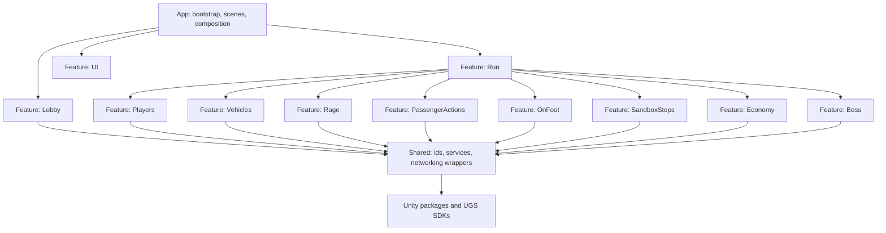
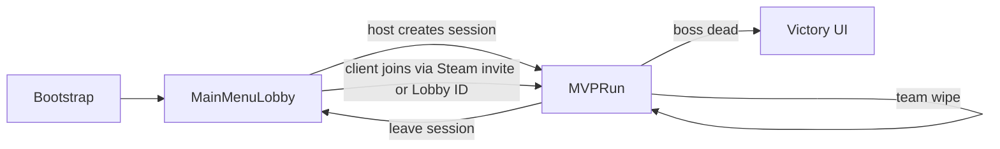
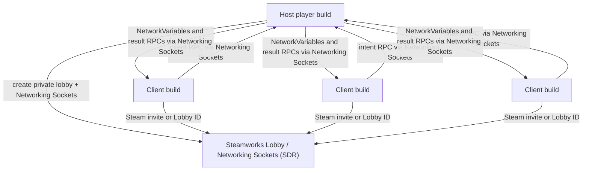
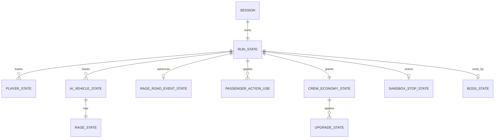

# Architecture Spine - Road Rage Simulator

## Design Paradigm

Feature-Sliced Host-Authoritative Unity.

The project is a Unity vertical slice where each gameplay feature owns its scripts, prefabs, data definitions, and UI fragments. A thin App layer composes scenes, services, and feature entry points. Shared code stays small and contains only reusable primitives, networking wrappers, data ids, and presentation helpers. Networked gameplay state is authoritative on the host player; clients submit player intent.



## Invariants & Rules

### AD-1 - Unity URP MVP Stack [ADOPTED]

- **Binds:** all
- **Prevents:** parallel engine, render pipeline, or networking implementations.
- **Rule:** The MVP uses Unity 6000.6.0f1 on the Unity 6 Update release track, C# 9.0 as supported by Unity, a Universal 3D/URP project, Netcode for GameObjects, Steamworks Networking Sockets (community Netcode transport - Facepunch or SteamNetworkingSockets) as the Netcode transport, Unity Transport, Cinemachine, Input System, and Blender as the 3D asset cleanup/export tool.

### AD-2 - Feature Slices Own Gameplay

- **Binds:** CAP-1, CAP-2, CAP-3, CAP-4, CAP-5, CAP-6, CAP-7
- **Prevents:** one shared gameplay folder becoming an unowned tangle.
- **Rule:** New gameplay code lands in a named feature slice; cross-feature coordination goes through Run orchestration, shared interfaces/events, or networked state objects, not direct feature-to-feature mutation.

### AD-3 - Host Owns Shared Runtime State [ADOPTED]

- **Binds:** CAP-1, CAP-3, CAP-4, CAP-5, CAP-7
- **Prevents:** clients disagreeing about rage, rewards, deaths, victory, or AI decisions.
- **Rule:** The host is authoritative for rage, money, upgrades, health/death, run phase, AI vehicle decisions, boss state, reward grants, and gameplay event triggers. Clients send intent; host validates and mutates.

### AD-4 - Steam Networking Sockets Are The Internet Path [ADOPTED]

- **Binds:** online co-op constraint, CAP-1
- **Prevents:** a prototype that works only with direct IP, LAN, VPN, manual port forwarding, or a metered/paid backend that scales cost with player count.
- **Rule:** Online sessions are private host-created Steam lobbies (`ISteamMatchmaking`) with `MaxPlayers = 4`, using Steamworks Networking Sockets (Steam Datagram Relay) as the NAT-traversal/relay path - free regardless of concurrent player count. Joining players connect via native Steam friend invite or a shared Steam Lobby ID used as the join code; both are UI wrappers around the same Steam lobby join, never a native OS deep link. Public matchmaking, lobby browsing, dedicated servers, and host migration are not part of the first MVP path. The MVP requires Steam as the sole distribution/runtime platform for online play; non-Steam builds do not support online co-op unless a later AD adds another transport.

### AD-5 - NetworkedRunState Owns Run Outcome [ADOPTED]

- **Binds:** CAP-7
- **Prevents:** victory/failure checks being duplicated in player, boss, scene, and UI scripts.
- **Rule:** One host-owned NetworkedRunState owns the run phase. If all players are dead it restarts the run from the beginning; if the boss state reaches dead it declares victory.

### AD-6 - One Loop, Not Two Games

- **Binds:** CAP-1, CAP-4, CAP-5, CAP-6
- **Prevents:** driving, on-foot, economy, and Rage Road becoming disconnected prototypes.
- **Rule:** Every MVP on-foot action, sandbox stop interaction, Rage Road event, reward, and upgrade must return value to the same driving-rage-money-upgrade loop.

### AD-7 - Arcade Vehicles Before Realistic Vehicle Simulation

- **Binds:** CAP-1, CAP-3
- **Prevents:** losing the MVP to tire physics, realistic traffic, or open-world driving systems.
- **Rule:** The first player car is an arcade Rigidbody-based controller. AI traffic follows route/lane/spline guidance with rage-driven behavior states. WheelCollider realism and broad traffic simulation are deferred.

### AD-8 - Rage Is Per Enemy Vehicle

- **Binds:** CAP-2, CAP-3, CAP-4
- **Prevents:** global rage meters or shared AI state hiding whether individual drivers react independently.
- **Rule:** Each AI vehicle has its own host-owned rage state machine with calm, irritated, flee, block, ram, and confrontation-capable states. Passenger actions and incidents target explicit vehicles.

### AD-9 - Passenger Actions Are Data-Defined Intents

- **Binds:** CAP-2, CAP-4, CAP-5
- **Prevents:** one-off action scripts that cannot be balanced, tested, or swapped.
- **Rule:** Passenger actions are authored as ScriptableObject definitions and executed as client intent sent to the host. Effects can change rage, spawn incidents, collect low-value resources, or help the crew, but host code grants the result.

### AD-10 - Camera And Input Are Local Presentation

- **Binds:** CAP-1, CAP-2, CAP-6
- **Prevents:** cameras or input handlers mutating shared state or being synchronized over the network.
- **Rule:** Each player has a local-only Cinemachine camera rig. Unity Input System action maps feed a PlayerIntent layer. Networked gameplay changes only happen through validated host-side actions.

### AD-11 - Three Scene Seed

- **Binds:** all
- **Prevents:** scene loading architecture expanding before the first loop works.
- **Rule:** Start with Bootstrap, MainMenuLobby, and MVP_Run scenes. Route, sandbox stop, Rage Road, and boss validation live in MVP_Run until additive scene loading is justified by working content.

### AD-12 - ScriptableObjects For Authored Static Data

- **Binds:** CAP-2, CAP-3, CAP-4, CAP-5, CAP-7
- **Prevents:** hard-coded upgrades, passenger actions, rage thresholds, and boss test config scattering across MonoBehaviours.
- **Rule:** Author static definitions as ScriptableObjects with stable ids. Runtime session values live in host-owned NetworkBehaviours and NetworkVariables, not inside ScriptableObject assets.

### AD-13 - Blender Intake Gate For 3D Assets [ADOPTED]

- **Binds:** solo feasibility constraint, art/style direction
- **Prevents:** AI-generated assets entering gameplay with broken scale, names, transforms, materials, normals, or excessive geometry.
- **Rule:** Every AI-generated or downloaded 3D asset must be cleaned in Blender, saved with its source file, exported as FBX or GLB, scale-tested in Unity, then converted to a prefab.

### AD-14 - Greybox First, Art Second

- **Binds:** MVP scope, solo feasibility constraint
- **Prevents:** polished characters, vehicles, or scenery consuming the project before multiplayer fun is proven.
- **Rule:** Build and verify the multiplayer core loop with primitives and placeholder materials before replacing any gameplay-critical object with final AI/Blender assets.

### AD-15 - Transient Session, No Game Backend

- **Binds:** MVP feasibility, operational envelope
- **Prevents:** cloud saves, accounts, secure economy, or production operations becoming hidden MVP dependencies.
- **Rule:** The MVP stores run state only in the active Unity session. Steamworks (Lobby + Networking Sockets) is used for session connection only, at no cost regardless of concurrent players. Persistent progression, real accounts, anti-cheat, analytics, and backend economy are deferred.

### AD-16 - MVP Slice Cardinality [ADOPTED]

- **Binds:** all MVP scope, CAP-1, CAP-2, CAP-3, CAP-4, CAP-5, CAP-6, CAP-7
- **Prevents:** builders proving different games with different scope counts.
- **Rule:** Until the MVP success signal passes, the first playable run contains one route, one player car, one host plus up to three joining clients, three spawned enemy vehicles, three passenger action definitions, one on-foot transition, one sandbox stop, one money reward, one upgrade, one Rage Road event, and one simple boss endpoint.

### AD-17 - Canonical Runtime State Shape

- **Binds:** CAP-1, CAP-3, CAP-4, CAP-5, CAP-6, CAP-7
- **Prevents:** duplicated truth across feature-owned NetworkBehaviours that cannot reset, display, or synchronize consistently.
- **Rule:** Runtime truth is split across named host-owned NetworkBehaviours: `NetworkedRunState` owns run phase, session seed, registries, active Rage Road event id, restart, and victory transitions; `NetworkedPlayerState` owns player lifecycle, mode, seat, and health; `NetworkedAIVehicleState` owns AI vehicle route/movement state; `NetworkedRageState` owns per-enemy rage; `NetworkedCrewEconomyState` owns wallet and purchased upgrades; `NetworkedBossState` owns the simple boss endpoint.

### AD-18 - Netcode Ownership And Intent Pipeline

- **Binds:** all networked gameplay
- **Prevents:** incompatible owner-authoritative and host-authoritative prefabs, RPCs, and NetworkVariable permissions.
- **Rule:** Gameplay-authoritative NetworkObjects are host-owned and gameplay NetworkVariables are server-write by default. Client-owned objects are limited to input/presentation proxies unless a later AD names an exception. Player actions become typed ServerRPC intents; host validation checks actor, run phase, player mode/seat, cooldown, target reference, range, and payload version before mutating state.

### AD-19 - Player Mode And Life Contract

- **Binds:** CAP-1, CAP-2, CAP-6, CAP-7
- **Prevents:** driving, passenger, on-foot, fight, death, and restart code representing "player" differently.
- **Rule:** Each connected player has one `NetworkedPlayerState` with `PlayerMode = Driver | Passenger | OnFootStop | OnFootRageRoad | Spectating` and `PlayerLifecycle = Alive | Downed | Dead`. The host owns seat assignment, with exactly one driver seat and up to three passenger seats. Team wipe is computed only from every connected player's `Dead` lifecycle; exact damage numbers, revive timing, and death tuning are deferred.

### AD-20 - Vehicle And Rage Attachment Contract

- **Binds:** CAP-2, CAP-3, CAP-4
- **Prevents:** Vehicles, Rage, PassengerActions, and UI reading different rage sources.
- **Rule:** Every enemy vehicle prefab has one `NetworkedAIVehicleState` and one attached `NetworkedRageState`. Rage owns the rage state machine; Vehicles reads rage through a narrow interface or event and never mutates it directly. Passenger action targets use `NetworkObjectReference` or the approved Netcode-safe equivalent, never authored ids or lane indexes.

### AD-21 - Host-Simulated Vehicle Movement

- **Binds:** CAP-1, CAP-3, CAP-4
- **Prevents:** client prediction, host physics, AI spline progress, collisions, and rage triggers diverging by feature.
- **Rule:** For MVP, the host simulates the player car Rigidbody, AI route progress, collisions, block/ram contacts, and rage trigger timing. Clients send driver input intent and receive replicated/smoothed transforms. Local prediction is presentation-only until a later vehicle-feel AD allows it.

### AD-22 - Rage Road Event Lifecycle

- **Binds:** CAP-4, CAP-5, CAP-6, CAP-7
- **Prevents:** Rage, Run, OnFoot, Vehicles, and Economy using incompatible meanings of a Rage Road event.
- **Rule:** Run owns one host-owned `RageRoadEventState` with `Idle -> Triggered -> Confrontation -> Resolved -> RewardGranted` transitions. Rage may request an eligible trigger, Run starts and advances the event, OnFoot/Vehicles report resolution intents, and Economy grants money only after Run reaches `Resolved`.

### AD-23 - Sandbox Stop Contract

- **Binds:** CAP-5, CAP-6
- **Prevents:** towns, stops, sandbox zones, purchases, happenings, and incidents becoming separate unbounded systems.
- **Rule:** The MVP has one `SandboxStop` feature slice. Run owns entry/exit; SandboxStops owns the compact zone interaction registry; Economy owns purchases/rewards; Rage owns rage-affecting incidents. A sandbox stop interaction must either prepare the road loop, buy/apply the MVP upgrade, create a low-value toy/resource, or trigger/escalate a road-loop incident.

### AD-24 - Economy And Upgrade Contract

- **Binds:** CAP-5, CAP-6
- **Prevents:** per-player money, crew money, reward splitting, and upgrade state competing.
- **Rule:** MVP currency is one integer crew wallet in `NetworkedCrewEconomyState`. All rewards and purchases go through host-side Economy transactions. The MVP has one road-rage reward definition and one upgrade definition; upgrades are authored as ScriptableObjects and applied as host-owned runtime state.

### AD-25 - Authored Data Catalog

- **Binds:** CAP-2, CAP-3, CAP-4, CAP-5, CAP-7
- **Prevents:** host and clients resolving the same action, upgrade, AI archetype, or boss config id to different data.
- **Rule:** ScriptableObject definitions live under feature-local `ScriptableObjects/<Feature>` folders and are registered into one Shared definition catalog at bootstrap. Definition ids are globally unique, lowercase, and validated by editor checks. Network payloads send definition ids only after host and clients load the same catalog version.

### AD-26 - Session Lifecycle And Run Composition

- **Binds:** CAP-1, CAP-7, operational envelope
- **Prevents:** duplicate NetworkManagers, broken lobby-to-run handoff, and restart flows that depend on inspector-only scene wiring.
- **Rule:** Bootstrap owns persistent services, Steamworks SDK initialization (`SteamClient.Init`) and Steam login state, and NetworkManager lifetime. MainMenuLobby creates or joins the private Steam lobby, then the host starts networking before synchronized load into MVP_Run. `RunCompositionRoot` resolves serialized layout roots, spawns/registries host-owned gameplay NetworkObjects, and on team wipe destroys and respawns the MVP run from known definitions. Host quit or lost session returns clients to MainMenuLobby with an error; it does not attempt host migration.

### AD-27 - Greybox-To-Art Prefab Stability

- **Binds:** art pipeline, CAP-1, CAP-3, CAP-4, CAP-7
- **Prevents:** replacing placeholder art from breaking NetworkObject registration, colliders, action bindings, or prefab references.
- **Rule:** Gameplay prefab identity, NetworkObject registration, gameplay components, colliders, and definition ids remain stable when art improves. Final meshes and materials replace child render objects or prefab variants after multiplayer validation; gameplay-critical colliders are authored separately from decorative meshes.

### AD-28 - Windows Dev Build Validation Envelope

- **Binds:** all MVP implementation work
- **Prevents:** features claiming success against incompatible local-only, editor-only, or production-service assumptions.
- **Rule:** The MVP targets Windows PC development builds first, using the Steamworks test AppID (`480`/Spacewar) as the non-production environment. Stack adoption requires an empty project package lock check, one local Multiplayer Play Mode host/client smoke test, one remote two-player Steamworks Networking Sockets smoke test, session cap validation at four players, host-quit handling, and visible Lobby/UI errors for join, Networking Sockets, disconnect, and service failures.

## Consistency Conventions

| Concern | Convention |
| --- | --- |
| Vocabulary | Use `sandbox stop` for the compact town/stop zone and `Rage Road event` for the triggered crisis/confrontation lifecycle. Do not introduce alternate names unless a new AD defines a distinct concept. |
| Naming | Feature folders use PascalCase nouns: `Lobby`, `Run`, `Players`, `Vehicles`, `Rage`, `PassengerActions`, `OnFoot`, `SandboxStops`, `Economy`, `Boss`, `UI`. Networked state components start with `Networked`. Client intent DTOs end with `Intent`. ScriptableObject definitions end with `Def`. |
| Namespaces and assemblies | Use `RoadRage.App`, `RoadRage.Shared`, and `RoadRage.Features.<Feature>`. Features reference Shared and approved Run-facing interfaces; App/Run composition may reference features. Direct feature-to-feature references require an interface/event in Shared or Run. |
| Shared eligibility | Shared may contain pure value types, ids, base network utilities, and narrow interfaces with no feature policy. Concrete gameplay services live in a feature or App/Run composition. |
| Data ids | Authored static data uses lowercase stable ids such as `passenger_action_throw_trash`. Runtime network object identity comes from Netcode, not from hand-written ids. |
| Intent payloads | Networked target references use `NetworkObjectReference` or the approved Netcode-safe equivalent. Intents include actor player id, action/interaction id, target reference when applicable, local request sequence, and payload version. |
| State mutation | Input handlers and UI scripts never mutate shared state directly. Client input becomes intent; host services mutate NetworkVariables, despawn/spawn objects, and grant rewards. |
| Time | Networked gameplay timers use server/host time. Local-only animation and camera smoothing may use local delta time. |
| Money | Currency is integer-only for MVP. Significant rewards come from road-rage confrontation; absurd actions remain low-value triggers or toys. |
| Error handling | User-facing network errors are surfaced by Lobby/UI. Developer diagnostics use feature-prefixed logs such as `[Lobby]`, `[Run]`, `[Rage]`. |
| Package changes | The stack table is the intended pin set. After Unity project creation, `Packages/manifest.json` and `Packages/packages-lock.json` become the resolved lock; any difference from the stack table is reviewed and logged. |
| Secrets | API keys, tokens, and Steamworks/Unity service credentials are never placed in scripts, scenes, ScriptableObjects, prompts, or committed files. Non-secret project IDs may exist in `ProjectSettings`/`steam_appid.txt` when required by services, but screenshots, logs, and prompts redact sensitive account, Lobby ID, invite, and Networking Sockets details unless explicitly reviewed. |
| C# style | Use Unity-supported C# 9.0. Avoid newer language assumptions and avoid relying on record/init-only types for Unity-serialized gameplay data. |

## Stack

| Name | Version |
| --- | --- |
| Unity Editor | 6000.6.0f1 on Unity 6 Update track |
| Unity project template | Universal 3D / URP for Unity 6.6 |
| C# | Roslyn / C# 9.0 as supported by Unity 6.6 |
| Universal Render Pipeline (`com.unity.render-pipelines.universal`) | 17.6.0 |
| Netcode for GameObjects (`com.unity.netcode.gameobjects`) | 2.13.2 |
| Steamworks transport (`com.community.netcode.transport.facepunch` or `.steamnetworkingsockets`) | commit/tag pinned at installation time (Story 0.2 revision) |
| Unity Transport (`com.unity.transport`) | 6.6.0 |
| Unity Multiplayer Play Mode (`com.unity.multiplayer.playmode`) | 3.0.0 |
| Cinemachine (`com.unity.cinemachine`) | 6.6.0 in Unity 6.6 |
| Input System (`com.unity.inputsystem`) | 1.20.0 |
| Blender | 5.2 LTS |
| 3D interchange | FBX or glTF/GLB 2.0 |

## Structural Seed

```text
RRS/
  Assets/
    RoadRage/
      App/
        Bootstrap/
        Scenes/
        Services/
      Shared/
        Domain/
        Definitions/
        Networking/
        Presentation/
        Utilities/
      Features/
        Lobby/
        Run/
        Players/
        Vehicles/
        Rage/
        PassengerActions/
        OnFoot/
        SandboxStops/
        Economy/
        Boss/
        UI/
      ArtSource/
        Blender/
        GeneratedReferences/
      ArtExports/
      Materials/
      Prefabs/
      ScriptableObjects/
      Tests/
  Packages/
  ProjectSettings/
  docs/
```







## Capability To Architecture Map

| Capability / Area | Lives in | Governed by |
| --- | --- | --- |
| CAP-1 cooperative driving loop | `Features/Run`, `Features/Vehicles`, `Features/Lobby` | AD-1, AD-3, AD-4, AD-6, AD-7, AD-14, AD-16, AD-21, AD-26, AD-28 |
| CAP-2 active passenger chaos | `Features/PassengerActions`, `Features/Rage` | AD-3, AD-8, AD-9, AD-10, AD-12, AD-16, AD-18, AD-20, AD-25 |
| CAP-3 per-vehicle rage | `Features/Rage`, `Features/Vehicles` | AD-3, AD-8, AD-12, AD-16, AD-17, AD-20, AD-21 |
| CAP-4 Rage Road crisis | `Features/Run`, `Features/Rage`, `Features/OnFoot` | AD-3, AD-5, AD-6, AD-8, AD-11, AD-16, AD-17, AD-22 |
| CAP-5 money and upgrade reward | `Features/Economy`, `Features/Run` | AD-3, AD-6, AD-12, AD-15, AD-16, AD-22, AD-24, AD-25 |
| CAP-6 on-foot preparation and confrontation | `Features/OnFoot`, `Features/Run`, `Features/Economy`, `Features/SandboxStops` | AD-6, AD-10, AD-11, AD-14, AD-16, AD-19, AD-22, AD-23 |
| CAP-7 team-wipe failure and boss-kill victory | `Features/Run`, `Features/Players`, `Features/Boss`, `Features/UI` | AD-3, AD-5, AD-11, AD-16, AD-17, AD-19, AD-26 |
| AI/Blender 3D asset workflow | `ArtSource`, `ArtExports`, `Materials`, `Prefabs`, `ScriptableObjects` | AD-13, AD-14, AD-27 |
| MCP assisted development | `mcp-tooling-setup.md` | AD-1, AD-13, AD-14, AD-28 |

## Open Questions

| Question | Must be answered before |
| --- | --- |
| What tone and content-rating boundaries apply to threats, pissing, fights, UI copy, and absurd provocation actions? | Final passenger action names, animations, UI copy, and generated character/prop assets. |
| What exact health values, revive windows, damage sources, and vehicle-destruction consequences make the loop fun? | Polishing combat, boss, and restart tuning beyond the minimal `Alive/Downed/Dead` contract. |

## Deferred

| Decision | Revisit when |
| --- | --- |
| Public matchmaking, lobby browser, and friend systems | Private join-code sessions work reliably with at least two remote players. |
| Dedicated servers and host migration | Host quitting or host advantage becomes a tested design problem. |
| Exact health, revive, vehicle destruction, and team-wipe tuning | The first combat/Rage Road greybox exists and already uses the minimal player lifecycle contract. |
| Full boss design | The simple host-owned boss endpoint validates CAP-7 and the core loop is fun. |
| Realistic vehicle physics, WheelCollider tuning, and broad traffic simulation | Arcade driving is fun but lacks a specific feel that cannot be tuned simply. |
| Additive scene loading and larger world streaming | MVP_Run becomes too large or slow to iterate safely. |
| Persistent accounts, cloud saves, analytics, anti-cheat, and secure economy | The game moves beyond private co-op prototype toward public release. |
| Console, mobile, WebGL, and store compliance | Windows PC development builds prove the MVP. |
| Large 3D asset volume and polished content pipeline automation | Greybox loop is playable online and the style guide is stable. |
| Rich city content and destructible cities | Outside current MVP and concept lock. |
