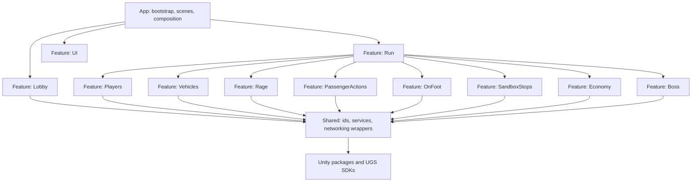
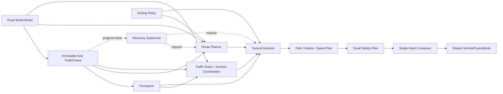
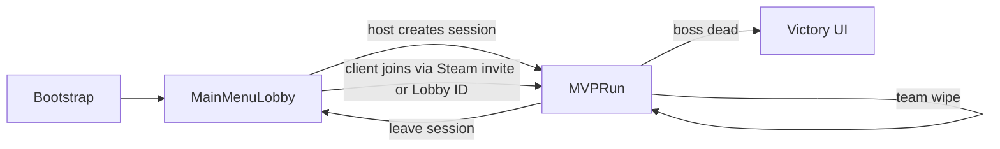
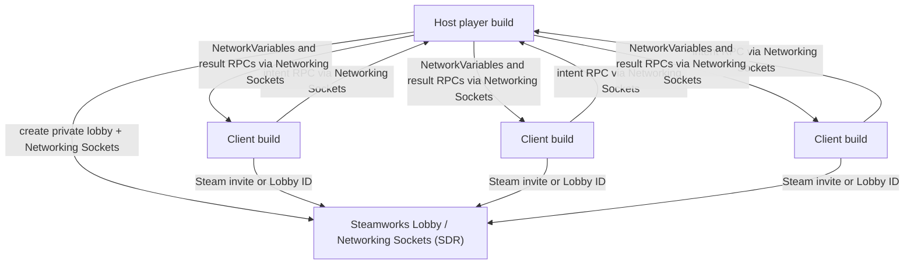
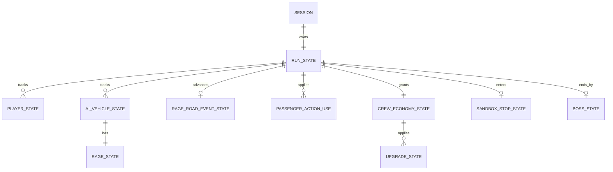

# Architecture Spine - Road Rage Simulator

## Design Paradigm

Feature-Sliced Host-Authoritative Unity.

The project is a Unity vertical slice where each gameplay feature owns its scripts, prefabs, data definitions, and UI fragments. A thin App layer composes scenes, services, and feature entry points. Shared code stays small and contains only reusable primitives, networking wrappers, data ids, and presentation helpers. Networked gameplay state is authoritative on the host player; clients submit player intent.

Traffic V2 applies a nested paradigm: **Snapshot-Driven Single-Intent Traffic Planning**. One immutable host frame feeds facts, permissions, goals, plans and a narrow safety veto before exactly one intent reaches shared vehicle physics.


```mermaid
flowchart TD
  App["App: bootstrap, scenes, composition"] --> Lobby["Feature: Lobby"]
  App --> Run["Feature: Run"]
  App --> UI["Feature: UI"]
  Lobby --> Shared["Shared: ids, services, networking wrappers"]
  Run --> Players["Feature: Players"]
  Run --> Vehicles["Feature: Vehicles"]
  Run --> Rage["Feature: Rage"]
  Run --> Passenger["Feature: PassengerActions"]
  Run --> OnFoot["Feature: OnFoot"]
  Run --> SandboxStops["Feature: SandboxStops"]
  Run --> Economy["Feature: Economy"]
  Run --> Boss["Feature: Boss"]
  Players --> Shared
  Vehicles --> Shared
  Rage --> Shared
  Passenger --> Shared
  OnFoot --> Shared
  SandboxStops --> Shared
  Economy --> Shared
  Boss --> Shared
  Shared --> UnityPackages["Unity packages and UGS SDKs"]
```

## Invariants & Rules

### AD-1 - Unity URP MVP Stack [ADOPTED]

- **Binds:** all
- **Prevents:** parallel engine, render pipeline, or networking implementations.
- **Rule:** The MVP uses Unity 6000.6.0f1 on the Unity 6 Update release track, C# 9.0 as supported by Unity, a Universal 3D/URP project, Netcode for GameObjects, Steamworks Networking Sockets (community Netcode transport - Facepunch or SteamNetworkingSockets) as the Netcode transport, Unity Transport, Cinemachine, Input System, and Blender as the 3D asset cleanup/export tool.

### AD-2 - Feature Slices Own Gameplay

- **Binds:** CAP-1, CAP-2, CAP-3, CAP-4, CAP-5, CAP-6, CAP-7
- **Prevents:** one shared gameplay folder becoming an unowned tangle.
- **Rule:** New gameplay code lands in a named feature slice; cross-feature coordination goes through Run orchestration, shared interfaces/events, or networked state objects, not direct feature-to-feature mutation.

### AD-3 - Host Owns Shared Runtime State [ADOPTED]

- **Binds:** CAP-1, CAP-3, CAP-4, CAP-5, CAP-7
- **Prevents:** clients disagreeing about rage, rewards, deaths, victory, or AI decisions.
- **Rule:** The host is authoritative for rage, money, upgrades, health/death, run phase, AI vehicle decisions, boss state, reward grants, and gameplay event triggers. Clients send intent; host validates and mutates.

### AD-4 - Steam Networking Sockets Are The Internet Path [ADOPTED]

- **Binds:** online co-op constraint, CAP-1
- **Prevents:** a prototype that works only with direct IP, LAN, VPN, manual port forwarding, or a metered/paid backend that scales cost with player count.
- **Rule:** Online sessions are private host-created Steam lobbies (`ISteamMatchmaking`) with `MaxPlayers = 4`, using Steamworks Networking Sockets (Steam Datagram Relay) as the NAT-traversal/relay path - free regardless of concurrent player count. Joining players connect via native Steam friend invite or a shared Steam Lobby ID used as the join code; both are UI wrappers around the same Steam lobby join, never a native OS deep link. Public matchmaking, lobby browsing, dedicated servers, and host migration are not part of the first MVP path. The MVP requires Steam as the sole distribution/runtime platform for online play; non-Steam builds do not support online co-op unless a later AD adds another transport.

### AD-5 - NetworkedRunState Owns Run Outcome [ADOPTED]

- **Binds:** CAP-7
- **Prevents:** victory/failure checks being duplicated in player, boss, scene, and UI scripts.
- **Rule:** One host-owned NetworkedRunState owns the run phase. If all players are dead it restarts the run from the beginning; if the boss state reaches dead it declares victory.

### AD-6 - One Loop, Not Two Games

- **Binds:** CAP-1, CAP-4, CAP-5, CAP-6
- **Prevents:** driving, on-foot, economy, and Rage Road becoming disconnected prototypes.
- **Rule:** Every MVP on-foot action, sandbox stop interaction, Rage Road event, reward, and upgrade must return value to the same driving-rage-money-upgrade loop.

### AD-7 - Arcade Vehicles Before Realistic Vehicle Simulation

- **Binds:** CAP-1, CAP-3
- **Prevents:** losing the MVP to tire physics, realistic traffic, or open-world driving systems.
- **Rule:** The first player car is an arcade Rigidbody-based controller. AI traffic follows route/lane/spline guidance with rage-driven behavior states. WheelCollider realism and broad traffic simulation are deferred.

### AD-8 - Rage Is Per Enemy Vehicle

- **Binds:** CAP-2, CAP-3, CAP-4
- **Prevents:** global rage meters or shared AI state hiding whether individual drivers react independently.
- **Rule:** Each AI vehicle has its own host-owned rage state machine with calm, irritated, flee, block, ram, and confrontation-capable states. Passenger actions and incidents target explicit vehicles.

### AD-9 - Passenger Actions Are Data-Defined Intents

- **Binds:** CAP-2, CAP-4, CAP-5
- **Prevents:** one-off action scripts that cannot be balanced, tested, or swapped.
- **Rule:** Passenger actions are authored as ScriptableObject definitions and executed as client intent sent to the host. Effects can change rage, spawn incidents, collect low-value resources, or help the crew, but host code grants the result.

### AD-10 - Camera And Input Are Local Presentation

- **Binds:** CAP-1, CAP-2, CAP-6
- **Prevents:** cameras or input handlers mutating shared state or being synchronized over the network.
- **Rule:** Each player has a local-only Cinemachine camera rig. Unity Input System action maps feed a PlayerIntent layer. Networked gameplay changes only happen through validated host-side actions.

### AD-11 - Three Scene Seed

- **Binds:** all
- **Prevents:** scene loading architecture expanding before the first loop works.
- **Rule:** Start with Bootstrap, MainMenuLobby, and MVP_Run scenes. Route, sandbox stop, Rage Road, and boss validation live in MVP_Run until additive scene loading is justified by working content.

### AD-12 - ScriptableObjects For Authored Static Data

- **Binds:** CAP-2, CAP-3, CAP-4, CAP-5, CAP-7
- **Prevents:** hard-coded upgrades, passenger actions, rage thresholds, and boss test config scattering across MonoBehaviours.
- **Rule:** Author static definitions as ScriptableObjects with stable ids. Runtime session values live in host-owned NetworkBehaviours and NetworkVariables, not inside ScriptableObject assets.

### AD-13 - Blender Intake Gate For 3D Assets [ADOPTED]

- **Binds:** solo feasibility constraint, art/style direction
- **Prevents:** AI-generated assets entering gameplay with broken scale, names, transforms, materials, normals, or excessive geometry.
- **Rule:** Every AI-generated or downloaded 3D asset must be cleaned in Blender, saved with its source file, exported as FBX or GLB, scale-tested in Unity, then converted to a prefab.

### AD-14 - Greybox First, Art Second

- **Binds:** MVP scope, solo feasibility constraint
- **Prevents:** polished characters, vehicles, or scenery consuming the project before multiplayer fun is proven.
- **Rule:** Build and verify the multiplayer core loop with primitives and placeholder materials before replacing any gameplay-critical object with final AI/Blender assets.

### AD-15 - Transient Session, No Game Backend

- **Binds:** MVP feasibility, operational envelope
- **Prevents:** cloud saves, accounts, secure economy, or production operations becoming hidden MVP dependencies.
- **Rule:** The MVP stores run state only in the active Unity session. Steamworks (Lobby + Networking Sockets) is used for session connection only, at no cost regardless of concurrent players. Persistent progression, real accounts, anti-cheat, analytics, and backend economy are deferred.

### AD-16 - MVP Slice Cardinality [ADOPTED]

- **Binds:** all MVP scope, CAP-1, CAP-2, CAP-3, CAP-4, CAP-5, CAP-6, CAP-7
- **Prevents:** builders proving different games with different scope counts.
- **Rule:** Until the MVP success signal passes, the first playable run contains one route, one player car, one host plus up to three joining clients, three spawned enemy vehicles, three passenger action definitions, one on-foot transition, one sandbox stop, one money reward, one upgrade, one Rage Road event, and one simple boss endpoint.

### AD-17 - Canonical Runtime State Shape

- **Binds:** CAP-1, CAP-3, CAP-4, CAP-5, CAP-6, CAP-7
- **Prevents:** duplicated truth across feature-owned NetworkBehaviours that cannot reset, display, or synchronize consistently.
- **Rule:** Runtime truth is split across named host-owned NetworkBehaviours: `NetworkedRunState` owns run phase, session seed, registries, active Rage Road event id, restart, and victory transitions; `NetworkedPlayerState` owns player lifecycle, mode, seat, and health; `NetworkedAIVehicleState` owns AI vehicle route/movement state; `NetworkedRageState` owns per-enemy rage; `NetworkedCrewEconomyState` owns wallet and purchased upgrades; `NetworkedBossState` owns the simple boss endpoint; `NetworkedLitterState` owns the thrown-litter registry, per-piece source attribution, and the configured live-litter cap.

### AD-18 - Netcode Ownership And Intent Pipeline

- **Binds:** all networked gameplay
- **Prevents:** incompatible owner-authoritative and host-authoritative prefabs, RPCs, and NetworkVariable permissions.
- **Rule:** Gameplay-authoritative NetworkObjects are host-owned and gameplay NetworkVariables are server-write by default. Client-owned objects are limited to input/presentation proxies unless a later AD names an exception. Player actions become typed ServerRPC intents; host validation checks actor, run phase, player mode/seat, cooldown, target reference, range, and payload version before mutating state.

### AD-19 - Player Mode And Life Contract

- **Binds:** CAP-1, CAP-2, CAP-6, CAP-7
- **Prevents:** driving, passenger, on-foot, fight, death, and restart code representing "player" differently.
- **Rule:** Each connected player has one `NetworkedPlayerState` with `PlayerMode = Driver | Passenger | OnFootStop | OnFootRageRoad | Spectating` and `PlayerLifecycle = Alive | Downed | Dead`. The host owns seat assignment, with exactly one driver seat and up to three passenger seats. Team wipe is computed only from every connected player's `Dead` lifecycle; exact damage numbers, revive timing, and death tuning are deferred.

### AD-20 - Vehicle And Rage Attachment Contract

- **Binds:** CAP-2, CAP-3, CAP-4
- **Prevents:** Vehicles, Rage, PassengerActions, and UI reading different rage sources.
- **Rule:** Every enemy vehicle prefab has one `NetworkedAIVehicleState` and one attached `NetworkedRageState`. Rage owns the rage state machine; Vehicles reads rage through a narrow interface or event and never mutates it directly. Passenger action targets use `NetworkObjectReference` or the approved Netcode-safe equivalent, never authored ids or lane indexes.

### AD-21 - Host-Simulated Vehicle Movement

- **Binds:** CAP-1, CAP-3, CAP-4
- **Prevents:** client prediction, host physics, AI route progress on the authored lane graph, collisions, and rage triggers diverging by feature.
- **Rule:** For MVP, the host simulates the player car Rigidbody, AI route progress, collisions, block/ram contacts, and rage trigger timing. Clients send driver input intent and receive replicated/smoothed transforms. Local prediction is presentation-only until a later vehicle-feel AD allows it.

### AD-22 - Rage Road Event Lifecycle

- **Binds:** CAP-4, CAP-5, CAP-6, CAP-7
- **Prevents:** Rage, Run, OnFoot, Vehicles, and Economy using incompatible meanings of a Rage Road event.
- **Rule:** Run owns one host-owned `RageRoadEventState` with `Idle -> Triggered -> Confrontation -> Resolved -> RewardGranted` transitions. Rage may request an eligible trigger, Run starts and advances the event, OnFoot/Vehicles report resolution intents, and Economy grants money only after Run reaches `Resolved`.

### AD-23 - Sandbox Stop Contract

- **Binds:** CAP-5, CAP-6
- **Prevents:** towns, stops, sandbox zones, purchases, happenings, and incidents becoming separate unbounded systems.
- **Rule:** The MVP has one `SandboxStop` feature slice. Run owns entry/exit; SandboxStops owns the compact zone interaction registry; Economy owns purchases/rewards; Rage owns rage-affecting incidents. A sandbox stop interaction must either prepare the road loop, buy/apply the MVP upgrade, create a low-value toy/resource, or trigger/escalate a road-loop incident.

### AD-24 - Economy And Upgrade Contract

- **Binds:** CAP-5, CAP-6
- **Prevents:** per-player money, crew money, reward splitting, and upgrade state competing.
- **Rule:** MVP currency is one integer crew wallet in `NetworkedCrewEconomyState`. All rewards and purchases go through host-side Economy transactions. The MVP has one road-rage reward definition and one upgrade definition; upgrades are authored as ScriptableObjects and applied as host-owned runtime state.

### AD-25 - Authored Data Catalog

- **Binds:** CAP-2, CAP-3, CAP-4, CAP-5, CAP-7
- **Prevents:** host and clients resolving the same action, upgrade, AI archetype, or boss config id to different data.
- **Rule:** ScriptableObject definitions live under feature-local `ScriptableObjects/<Feature>` folders and are registered into one Shared definition catalog at bootstrap. Definition ids are globally unique, lowercase, and validated by editor checks. Network payloads send definition ids only after host and clients load the same catalog version.

### AD-26 - Session Lifecycle And Run Composition

- **Binds:** CAP-1, CAP-7, operational envelope
- **Prevents:** duplicate NetworkManagers, broken lobby-to-run handoff, and restart flows that depend on inspector-only scene wiring.
- **Rule:** Bootstrap owns persistent services, Steamworks SDK initialization (`SteamClient.Init`) and Steam login state, and NetworkManager lifetime. MainMenuLobby creates or joins the private Steam lobby, then the host starts networking before synchronized load into MVP_Run. This applies uniformly to solo and multiplayer starts: "Start Game" and "Create Lobby" are two menu entry points into the same private-lobby-then-host path — a single-member lobby is not a separate offline mode. There is no scene-load path that bypasses lobby creation and host networking. `RunCompositionRoot` resolves serialized layout roots, spawns/registries host-owned gameplay NetworkObjects, and on team wipe destroys and respawns the MVP run from known definitions. Host quit or lost session returns clients to MainMenuLobby with an error; it does not attempt host migration.

### AD-27 - Greybox-To-Art Prefab Stability

- **Binds:** art pipeline, CAP-1, CAP-3, CAP-4, CAP-7
- **Prevents:** replacing placeholder art from breaking NetworkObject registration, colliders, action bindings, or prefab references.
- **Rule:** Gameplay prefab identity, NetworkObject registration, gameplay components, colliders, and definition ids remain stable when art improves. Final meshes and materials replace child render objects or prefab variants after multiplayer validation; gameplay-critical colliders are authored separately from decorative meshes.

### AD-28 - Windows Dev Build Validation Envelope

- **Binds:** all MVP implementation work
- **Prevents:** features claiming success against incompatible local-only, editor-only, or production-service assumptions.
- **Rule:** The MVP targets Windows PC development builds first, using the Steamworks test AppID (`480`/Spacewar) as the non-production environment. Stack adoption requires an empty project package lock check, one local Multiplayer Play Mode host/client smoke test, one remote two-player Steamworks Networking Sockets smoke test, session cap validation at four players, host-quit handling, and visible Lobby/UI errors for join, Networking Sockets, disconnect, and service failures.

### AD-29 - Persistent Profile Is Pre-Lobby Cosmetic Data [ADOPTED]

- **Binds:** MVP 1 player entry, lobby, spawn, presentation.
- **Prevents:** persistent profile objects owning runtime life, wallet, inventory, seat, lobby, or network state.
- **Rule:** On first launch, create a locally persisted profile from Steam identity with Steam display name and a selected cosmetic `CharacterId`. Rookie is the default; Rookie/Veteran have no gameplay effect. Main Menu is the only selection surface and owns its local preview. Lobby entry freezes the selection. The existing connection payload, host resolution, `NetworkedPlayerState.CharacterId`, and runtime presentation carry the frozen choice into a session.

### AD-30 - MVP 1 Foundations Before MVP 2 Assembly [ADOPTED]

- **Binds:** roadmap, Run, Boss, SandboxStops, Economy, AI traffic.
- **Prevents:** city/highway levels, boss flow, checkpoint logic, and final run state being built around unvalidated foundations.
- **Rule:** MVP 1 uses isolated development sandboxes and small greybox integrations to validate reusable systems. MVP 2 alone composes them into roguelite levels, normal level transitions, inter-level checkpoint restart, bosses, balancing, and presentation. Exact reset requirements for mandatory assets after restart remain deferred.
- **Clarification 2026-09-15:** the greybox urban district delivered by Epic 5 is a *small greybox integration* under this rule — a proving ground for traffic, driving, and rage/fear reactions. It is not the MVP 2 Level 1 city: it carries no shops, equipment, boss, vehicle access, or litter recovery, and no run/level/checkpoint contract is introduced with it.

### AD-31 - Individual Economy and Configurable NPC Response [ADOPTED]

- **Binds:** Economy, Inventory, Rage, Vehicles, PassengerActions, future NPC behavior.
- **Prevents:** shared wallet ownership, Rage/Fear hard-coded inside one vehicle controller, and level-specific behavior leaking into reusable features.
- **Rule:** Every runtime wallet, owned item, and temporary resource belongs to one player and is mutated by the host. `NetworkedCrewEconomyState` is superseded before real economy work. NPC response state supports data-defined Rage and Fear tendencies; effects may change one or both meters, while vehicle movement and archetype behavior consume the resulting response through narrow feature boundaries.

### AD-32 - Configurable Traffic Headcounts And Validation Scale [ADOPTED]

- **Binds:** Vehicles, Run, Lobby, AI traffic, Epic 5 scope.
- **Supersedes:** the "three spawned enemy vehicles" clause of AD-16, which remains historical.
- **Prevents:** the original MVP cardinality blocking urban traffic; headcounts hard-coded inside a controller; and, symmetrically, an unmeasured scale ambition being written down as a contract.
- **Rule:** Traffic headcounts - the maximum number of circulating AI vehicles and the number of vehicles allowed to throw litter - are **configurable and never hard-coded**. Default values and minimum/maximum bounds are authored in a `Def` ScriptableObject (AD-12, AD-25); the value chosen for a session lives in `MatchSettings` and travels its existing synchronization path (Stories 1.2 and 2.4), never inside a ScriptableObject asset. Epic 5's validation target is approximately **30 simultaneous AI vehicles**. Any larger production scale is an **empirical decision** taken after the Story 5.22 measurement (ex-5.17), and is never written into architecture before that measurement. AD-16's other cardinalities (one route, one player car, four players) are unchanged.

### AD-33 - Parameterized Driving And Emotional Modulation [ADOPTED]

- **Binds:** Vehicles, Rage, AI traffic, any future driver archetype.
- **Prevents:** rage and fear being implemented as parallel driving states, speed multipliers, or extra branches bolted onto a monolithic state machine.
- **Rule:** An AI vehicle's driving style is an **authored parameter struct** (time headway, minimum gap, acceleration, comfortable deceleration, desired speed, lane-change politeness, change threshold, acceptable imposed braking), carried by a `Def` ScriptableObject. Longitudinal acceleration and the lane-change decision are computed by pure functions from that struct. Rage and fear produce **effective** parameters by modulation - `effective = base x f(rage, fear)` - and **never replace the driving logic**. `com.unity.ai.navigation` is used **only as a path provider**: `updatePosition` and `updateRotation` stay `false` and the host Rigidbody drives (AD-21 unchanged). A vehicle never carries `NavMeshAgent` and `NavMeshObstacle` at the same time, and carving is never active on a moving vehicle.

### AD-34 - Source/Sink Traffic And Street Object Lifecycle [ADOPTED]

- **Binds:** Vehicles, Run, AI traffic, litter, future level content.
- **Prevents:** vehicles appearing or vanishing mid-road, and thrown objects accumulating without bound.
- **Rule:** AI vehicles **spawn and despawn exclusively at authored entry/exit portals**. No mechanism - blockage, congestion, distance to player, or route failure - may remove a vehicle anywhere else. Route variation comes from a **per-junction turn draw** with authored ratios, not from a per-vehicle authored itinerary. A vehicle whose route exceeds an authored edge budget is redirected to the nearest exit. Objects thrown onto the street are host-owned NetworkObjects, reference their thrower through `NetworkObjectReference` (AD-20), and are bounded by a configured global cap with oldest-first recycling.

### AD-35 - Raycast Wheel Model, One Physics Layer For Player And AI [ADOPTED]

- **Binds:** CAP-1, CAP-3, Vehicles, AI traffic.
- **Prevents:** the vehicle feel layer becoming a black box that can only be proven by running the simulation, and player and AI vehicles drifting into two different physical behaviours.
- **Rule:** Ground contact, suspension, and tire force are computed from **per-wheel raycasts** driven by pure functions over an authored parameter struct carried by a `VehicleProfileDef` ScriptableObject (AD-12, AD-25). **`WheelCollider` is not used.** The player car and every AI vehicle run the **same** physics component; an AI driver emits a `VehicleDriveIntent` (steer, throttle, brake, handbrake) and **never** writes the `Rigidbody`'s velocity, position, or rotation. The physics layer reads `VehicleProfileDef` only, and never reads rage, fear, or any driver disposition - emotional modulation acts on the driver profile above it (AD-33). The host remains the sole simulator (AD-21).
- **Why raycast and not `WheelCollider`:** suspension, slip, tire force, and grip stay **pure functions verifiable in EditMode**, where the suite is green and filterable; a `WheelCollider` model is only provable during a physics step, and the PlayMode suite is red and unfilterable. This is a testability decision, not a fidelity one.
- **Relation to AD-7:** AD-7 is **unchanged and unsuperseded**. Its deferral entry reopens on "arcade driving is fun but lacks a specific feel that cannot be tuned simply"; that condition is *not* met - there is no wheel model to tune at all. AD-35 builds the arcade model AD-7 called for. Realistic tire simulation and `WheelCollider` tuning stay deferred.

### AD-36 - Freeze V1, Build And Gate Traffic V2 Beside It [ADOPTED]

- **Binds:** Vehicles, AI traffic, Epic 5 planning, `ANO-5.10-03`, MVP_Run validation.
- **Supersedes:** Stories 5.17-5.23 as executable backlog; any interpretation that Story 5.14 delivered collision response or physical lane recovery; and AD-7's deferral of broad traffic simulation only for the approved Traffic V2 program. AD-7's arcade/shared-physics intent remains binding.
- **Prevents:** losing historical behavior during an in-place rewrite; extending the V1 controller with the remaining traffic responsibilities; maintaining V1 and V2 indefinitely as two products.
- **Rule:** Traffic V1 is capability-frozen at accepted reference commit `210f48811e3f99fbb93c5d2aa75885e65edcf878` and remains an oracle while Traffic V2 is built beside it. Story 5.14 is complete and no additional V1 runtime recipe, PlayMode-harness repair, branch or tag gates Road World Model design. V2 reuses the pure driver kernels, `DriverProfileDef`, `VehicleDriveIntent`, `VehiclePhysicsBody`, host authority and existing session/network foundations where their contracts remain sound. V1 retires only after every oracle scenario passes in V2, is consciously replaced by an approved successor scenario, or is declared obsolete with recorded risk, plus `MVP_Run` host/client integration. AD-43 through AD-47 are the Fast-path gate proposal, accepted by the owner on 2026-09-22 with two recorded clarifications (re-import identity stability plus version canonicalization, and control-binding semantics); AD-48 later resolves the lateral cross-section ordering left contradictory in AD-43. Traffic V2 stories may now be planned, but none are generated by this architecture run.

### AD-37 - Snapshot-Driven Single-Intent Traffic Pipeline [ADOPTED]

- **Binds:** all Traffic V2 decision, debug and vehicle-control units.
- **Prevents:** update-order behavior, mixed-time world reads, direct actuation by competing subsystems, and route/path/trajectory collapsing back into one target index.
- **Rule:** One host-built immutable `TrafficFrame` version feeds objective per-agent observations. Route Planning consumes the Road World Model plus same-frame localization/closures and policy costs; Traffic Rules/Junction Coordination consumes Road World Model movement semantics plus same-frame observations/signal state and coordinator-owned prior grants. Dependency then flows into Tactical Decision -> local Path/Motion/Speed Plan -> Safety Filter -> one `VehicleDriveIntent` composer -> shared `VehiclePhysicsBody`. Recovery observes this flow and may request new planning work but is not an actuator. `RoutePlan`, continuous local path and timed motion/speed plan are distinct contracts even if a first implementation colocates them. Speed concerns contribute named constraints rather than pedals. Each authoritative evaluation publishes a separate decision/debug projection keyed to its source `TrafficFrame`, with stable reason codes for route, goal, blockers, grant, binding speed constraint, safety and recovery; the input frame is never mutated with those outputs. Requests derived from frame N are junction-resolved as one deterministic batch and published as versioned grants effective in the next decision frame. A held plan carries source-frame and validity epochs; the composer emits it or Idle once per physics step, while Safety may read a separately labelled current-step near-field sample only for `SimulationInvariant` vetoes.


```mermaid
flowchart LR
  RWM["Road World Model"] --> Frame["Immutable host TrafficFrame"]
  Frame --> Perception
  RWM --> Route["Route Planner"]
  Frame --> Route
  Policy["Driving Policy"] --> Route
  Perception --> Rules["Traffic Rules / Junction Coordination"]
  RWM --> Rules
  Frame --> Rules
  Perception --> Tactical["Tactical Decision"]
  Route --> Tactical
  Rules --> Tactical
  Policy --> Tactical
  Tactical --> Plan["Path / Motion / Speed Plan"]
  Plan --> Safety["Small Safety Filter"]
  Safety --> Composer["Single Intent Composer"]
  Composer --> Physics["Shared VehiclePhysicsBody"]
  Recovery["Recovery Supervisor"] -. request .-> Route
  Recovery -. request .-> Tactical
  Frame -. progress facts .-> Recovery
```

### AD-38 - Semantic Road World Model With One-Way V1 Migration [ADOPTED]

- **Binds:** Traffic V2 authoring, routing, localization, junctions, signals, portals and validation.
- **Supersedes:** AD-34's prohibition on per-vehicle itineraries and its point-node/per-junction-draw routing implication; AD-33's NavMesh path-provider clause for Traffic V2; AD-34's portal-only lifecycle and AD-33's parameterized driving/modulation contract remain binding.
- **Prevents:** hierarchy order acting as identity; runtime proximity joining as topology truth; rebuilding the existing district manually without need; forcing every road property onto one `Lane` type before the schema is understood.
- **Rule:** Traffic V2's authoritative runtime road model carries stable identity and validated semantic capability for directed drivable corridors, connectivity/adjacency, lane-to-lane junction movements, stop lines, conflicts, applicable rules/signals and portals. Existing visual road geometry and useful V1 nodes, directions, portals and weights are migrated through one-way editor/import tooling with source traceability and a visual validation overlay; missing semantics are explicit authoring errors and are never silently invented. The exact ownership split among road section, lane/corridor, adjacency, movement, signal and geometry records is decided at the architecture gate before stories, not fixed by this AD. V1 and V2 never form a bidirectionally synchronized runtime graph. NavMesh is not a Traffic V2 road or route authority; any later supplemental use for measured unstructured/off-road recovery requires a new decision.

### AD-39 - Traffic Rules Are Bendable; Simulation Invariants Are Not [ADOPTED]

- **Binds:** DrivingPolicy, Road Rage, junction coordination, safety, recovery and physics.
- **Prevents:** a generic `safety` or `rage` bypass swallowing tactical policy; ordinary law compliance being confused with engine/world integrity; intentional Rage contact disabling all collision protection.
- **Rule:** `TrafficRules` describe legal/cooperative behavior. `DrivingPolicy` may only propose an explicit, inspectable, target/scope-bound exception with a termination condition; Traffic Rules/Junction Coordination is the sole authority that accepts or denies it and publishes a frame-versioned effective exception. No legal exception waives conflict-compatible junction grants. Accepted plans carry exception target, scope and expiry so Safety never reads live policy state. `SimulationInvariants` bind every policy: host-only mutation, one coherent frame, stable deterministic ordering/seed domains, one finite intent composer, shared-physics-only nominal body movement, version-valid identities/plans, portal-only logical-agent entry/exit, compatible junction grants, target-scoped authorization for intentional contact, and rejection of invalid/non-finite controls. A representation may unload away from a portal only if the logical traffic agent remains alive with identity, route/policy/progress and deterministic restoration, without visible pop. The composer/physics boundary rejects non-finite intent or authority inputs and applies `Idle`; retaining the V1 DTO/physics code does not waive this V2 hardening. The `SafetyFilter` only passes, clamps, emergency-stops or rejects for objective invariant failures such as imminent unintended collision, stale plan/frame, invalid actor state or non-finite output; it never chooses routes, maneuvers, targets, priority or recovery.

### AD-40 - Collision Response And Recovery Are Supervisory Planning Concerns [ADOPTED]

- **Binds:** `ANO-5.10-03`, Traffic V2 Tactical Decision, progress monitoring, road localization and physics.
- **Prevents:** the 60-second V1 stuck timer or `RecoverAtWaypoint` teleport becoming the V2 design; recovery becoming a second Traffic AI or granting itself right-of-way.
- **Rule:** Tactical Decision remains the sole tactical-goal owner. Collision analysis supplies versioned facts or requests a response mode while the body is physically unstable; Tactical accepts or rejects the request with a reason and owns the active collision-response goal through completion/cancellation. Recovery begins only after stability when expected progress and actual progress diverge without a legitimate blocker. Recovery Supervisor owns detection, attempt history and requests; Tactical uses the same handshake and owns an accepted recovery maneuver through completion/cancellation. Recovery cannot grant priority, rewrite TrafficRules, bypass SimulationInvariants, compose intent, move a Rigidbody, teleport, reinsert or despawn normal traffic. If no invariant-preserving plan exists, the host traffic lifecycle owns a `Faulted` state with safe stop and diagnostics; any cleanup/removal requires the separately approved run-level catastrophic policy. Normal waits retain a set of named blockers with legitimacy, recoverability and start frame; a dominant debug reason never discards the underlying set.

### AD-41 - One Driving Stack For Normal And Road Rage Policy [ADOPTED]

- **Binds:** Vehicles, Rage, Fear, targeting and future Road Rage behaviors.
- **Prevents:** a second Road Rage controller duplicating perception, planning and physics; emotional state leaking into `VehicleProfileDef` or another vehicle.
- **Rule:** Normal, fearful, enraged and targeted drivers share the Traffic V2 perception, route, junction, tactical, planning, safety, intent and physics stack. Authored personality plus Rage/Fear may alter effective driver parameters, costs, maneuver eligibility and explicit `TrafficRule` exceptions. Intentional contact requires a valid target-scoped policy authorization and remains subject to every `SimulationInvariant`.

### AD-42 - Traffic Fidelity Scaling Is Profile-Gated [ADOPTED]

- **Binds:** Traffic V2 identity, networking, route progress, population lifecycle and scale validation.
- **Prevents:** prematurely building three simulation implementations; later LOD transitions changing identity, route or visible lifecycle.
- **Rule:** Traffic V2 preserves a live logical traffic agent with stable identity, driver policy/emotional state, route/destination, lane progress, host authority and portal-only visible entry/exit across any future fidelity transition. A physical/network presentation may be created or released away from a portal only when that logical continuity and deterministic restoration survive without visible pop. Near/mid/far representation, cadence and physics choices are implemented only after a functionally correct full-fidelity V2 is profiled in the target scene, unless an earlier reproducible measurement proves a budget violation. This supersedes AD-32's Story-5.22-specific production-scale trigger; AD-32's configurable population contract and approximate 30-vehicle benchmark remain binding, but the benchmark is not proof of production scale.

### AD-43 - Road Semantics Have Separate Logical Owners [ADOPTED]

- **Binds:** Road World Model data, routing, lane change, junctions, signals, portals and authoring tools.
- **Prevents:** one overloaded `Lane` object, duplicate connectivity owners and a storage layout becoming the domain contract.
- **Rule:** `RoadSection` owns road-level grouping/defaults; directed `LaneCorridor` owns reference geometry, width envelope and lane legality; `LaneConnection` owns longitudinal continuation/merge/split; `LaneAdjacency` owns side, paired arc-length intervals and lane-change legality; `JunctionMovement` owns legal from/to traversal and movement geometry; `JunctionControl` alone owns approach control and stop/yield line; `ConflictZone` alone owns movement/circulating-occupancy conflict membership; `SignalPlan` groups alone own signal membership/phases; `Portal` owns entry/exit placement; `ImportManifest`/`SourceTrace` owns typed many-to-many provenance. A traversal that crosses a junction is always a `JunctionMovement` and never a `LaneConnection`; junction-wide classification may validate movement controls but never overrides them. Child foreign keys are persisted truth; inverse parent collections and hot indexes are compiler-derived only, and the ordering of a derived collection carries no semantics unless another `AD` supplies the authored fact it is ordered by — lateral cross-section order is supplied by AD-48. Runtime storage nesting and C# names may differ, but ownership and reference direction may not.

### AD-44 - Road Identity Is Opaque, Stable And Versioned [ADOPTED]

- **Binds:** road authoring/import, networking/debug references, frames, localization, routes and grants.
- **Prevents:** hierarchy order, names, positions or transient indexes becoming identity; reimport silently changing every reference.
- **Rule:** The model and every semantic road element carry a generated serialized 128-bit ID independent of name, hierarchy, index, transform and `NetworkObjectId`. A persistent import manifest maps one semantic ID/import slot to zero-to-many typed source keys and supports many-to-many lineage; grouping/splitting or recreated sources require explicit remap, and deleted IDs are never recycled. Re-import must not mint new identities: a lineage-identical V2 entity keeps its stable ID, genuinely new entities receive new IDs, and a removed or replaced entity is disposed explicitly by the migration report instead of silently reappearing under another identity — how the mapping is persisted and compared remains an implementation choice. Only the Road Model compiler emits the version from `CompilerSchemaVersion` plus canonical behavior-affecting compiled data; canonicalization is order-independent, so semantically identical models hash identically regardless of source traversal, collection or serialization order, with deterministic numeric encoding and stable set ordering (the concrete format being an implementation choice), while any behaviorally meaningful change to topology, geometry, usable width, movement/control semantics, conflicts, signals or portals changes it. Labels, provenance, record order and rebuildable indexes stay outside the hash, and consumers never recompute it. Runtime ordinals are version-local caches only; unresolved/duplicate IDs or cross-version references fail validation.

### AD-45 - Road Geometry Is A Directed 3D Arc-Length Corridor [ADOPTED]

- **Binds:** road authoring, localization, path/motion planning, obstacle indexing and recovery.
- **Prevents:** a point list remaining the driving authority; planar-nearest localization snapping displaced or wrong-way vehicles to an arbitrary lane; a transitive spline package becoming accidental architecture.
- **Rule:** Every corridor and movement exposes a package-independent directed 3D curve with metre arc coordinate `s`, tangent, road-up, curvature, asymmetric width profile and deterministic bounds/samples. The local frame is `right = cross(up, tangent)`; lateral offset is positive right, normal offset positive up, and heading error is signed about road-up with absolute value above `90 degrees` flagged wrong-way. Localization uses one `TrafficFrame` vehicle-footprint anchor and returns model/version, element kind (`LaneCorridor` or `JunctionMovement`), stable ID, `s`, offsets, heading, confidence, composable outside/wrong-way/ambiguous flags and ordered alternatives; it uses geometry, route/connectivity and deterministic hysteresis, never planar proximity alone and never moves the Rigidbody. Unlocalized carries no current element. The `MVP_Run` geometry gates (curve error `0.05 m`, seam gap `0.05 m`, endpoint tangent mismatch `5 degrees`, migrated-node drift `0.10 m`, portal drift `0.05 m`, vehicle lateral margin `0.25 m` per side) are **provisional initial V2 acceptance targets, not measured V1 behaviour** — only the `0.75 m` V1 connector threshold is inherited, and V1 has no curve compiler; the first migration report must publish observed maxima, and any relaxation requires an explicit owner decision.

### AD-46 - Junction Safety Semantics Are Explicit And Compiled Offline [ADOPTED]

- **Binds:** junction authoring, right-of-way, signals, blocked exits, roundabouts and validation.
- **Prevents:** runtime topology/name inference deciding priority; absent signal data meaning green; conflict logic diverging between junction shapes.
- **Rule:** Each legal traversal is an explicit movement with exactly one authoritative control binding: one `JunctionControl` owns it and alone declares control kind and optional stop/yield line, though that binding may carry internal states or conditional policy — two independent systems never arbitrate the same movement. The binding is the authored rule: an ordinary `DrivingPolicy` obeys it, and an explicitly authorized gameplay policy such as Road Rage violates only a violable rule through the Traffic Rules/Junction Coordination authority, never by rewriting the control model and never outside `SimulationInvariants` or the SafetyFilter. Tooling may generate conflict candidates from swept envelopes of the model's declared maximum supported vehicle footprint (a versioned validation-profile value), but `ConflictZone` alone materializes reviewed/versioned membership and runtime never infers it. Every signalized control is covered by exactly one group in a complete valid `SignalPlan`; explicitly unsignalized controls require no dummy plan. Roundabouts use ordinary circulating corridors plus explicit entry/exit movements and yield conflicts, never cycle-shape inference. Blocked-exit state remains dynamic coordination data derived from the movement's departure corridor.

### AD-47 - V1 Migration Is One-Way And `MVP_Run` Is The Acceptance Map [ADOPTED]

- **Binds:** Traffic V2 migration tooling, validators, overlays and the pre-story architecture gate.
- **Prevents:** manual district reconstruction by default; silent invention of missing semantics; claiming migration from source counts alone.
- **Rule:** The importer preserves V1 node poses/directions, successors, connector matches, weights and portals as traceable candidates, then requires explicit review of widths, adjacency, movements, controls, lines, conflicts and signals; opposing lanes never become lane-change adjacency. A machine report bound to exact source hash, importer/compiler version, model ID and model version disposes every one of the 204 nodes plus every edge, weight, connector match and portal role, including merges/rejections, with each preserved weight resolving to a named target choice. The report declares and proves its source set: every `MVP_Run` module instance must resolve to a recognised imported source, so an unknown module prefab or a loose lane-node hierarchy fails instead of silently staling the 25-module/204-node baseline — existing guards cover connectors, portals, reachability and turn counts, not scene exclusivity. It proves four entry/four exit portals, reachability, twelve crossroads movements, six per T, roundabouts represented without cycle inference, semantic completeness, localization fixtures, zero hard errors/undisposed inputs and hash-bound `MVP_Run` overlay sign-off. Owner acceptance, recorded on 2026-09-22, closes the architecture gate; it does not claim implementation.

### AD-48 - Lateral Cross-Section Order Is An Authored Fact On The Child [ADOPTED]

- **Binds:** Road World Model records, compiler, validator, versioning, lane-change/overtaking semantics, authoring tools, V1 migration.
- **Prevents:** opaque `RoadId` order passing as lane semantics; an authorable corridor collection reappearing on `RoadSection`; a fixed section direction vector going degenerate on a bend or a roundabout; a corridor carrying an order no geometry can ever ground or refute; two conforming validators disagreeing on the same model because projection or comparison was left undefined; a driver-relative consumer reading a section-frame order as “my right lane” and inverting side for half a two-way carriageway; order inferred at runtime or silently defaulted during migration; two models with different lane orders hashing identically.
- **Rule:** Lateral position across a carriageway is authored, never derived from identity order and never recovered from `LaneAdjacency`, which by AD-47 never links opposing lanes and so cannot cross a two-way section at all. Both facts sit on the child, so `RoadSection` gains nothing and still carries no corridor collection of any kind: `LaneCorridor` carries a persisted integer `LateralOrder` and a persisted `IsCrossSectionDatum` flag beside its `SectionId` foreign key. The **datum corridor** — exactly one per section, chosen by the author and deliberately independent of which corridor holds order `0` — supplies the frame: ascending `LateralOrder` runs toward that corridor's AD-45 road-right, evaluated **locally at each arc position**, so the frame rotates with the road and stays meaningful through curves, forks and roundabout circulating corridors where a single fixed direction vector would not. One total order spans the section's whole carriageway with both travel directions included, so a two-way road is one cross-section rather than two unrelated sequences. **The order is a section-frame fact, not a driver-frame one:** for a corridor travelling opposite the datum, ascending `LateralOrder` runs toward that corridor's own road-*left*, so a driver-relative consumer resolves side through the corridor's own AD-45 frame and never by comparing `LateralOrder` across opposite-direction corridors. `LaneAdjacency.LaneSide` stays the authority for driver-relative side and `LateralOrder` the authority for carriageway position; the two are compared over the adjacency's own arc interval and disagreeing anywhere in it fails validation, rather than one silently winning. **A datum grounds every corridor it orders:** each of a section's other corridors overlaps the datum's arc domain over a non-empty interval, and every corridor in the section runs roughly parallel or roughly antiparallel to the datum — a set that cannot all be grounded on one datum is not one cross-section and is authored as several sections. Lateral comparison is the nearest-point projection onto the datum's curve restricted to that overlap interval, smallest `s` breaking a tie, so it is single-valued on a bend and around a loop. A single-corridor section is its own datum and carries no geometric claim. Validation is structural and needs no curve mathematics: per section `LateralOrder` is unique and contiguous from `0` with no gap, and exactly one corridor is the datum; each failure carries its own validation code, never one bundled code. Every geometric agreement follows the AD-45 shape invariants and belongs to the geometry owner. `LateralOrder` and the datum flag are behaviour-affecting compiled data inside the AD-44 canonical payload — an authored semantic position is not the excluded “record order” — and adding them increments `CompilerSchemaVersion`, free only while no compiled model has shipped. Because both are authoring-mutable, AD-44 lineage matching never keys on either: inserting a lane shifts every sibling's order and is a version change, never an identity change, and a split or merge re-authors the section's order, which the AD-47 migration report disposes explicitly. The compiler-derived corridors-by-section list is ordered by ascending `LateralOrder`, with ascending `RoadId` kept solely as a deterministic tie-break for a model that already failed validation.

### Course-correction supersessions

AD-5, AD-6, AD-8, AD-15, AD-16, AD-17, AD-22, AD-24, and AD-26 remain historical design context only where they prescribe one integrated MVP route, team-wipe restart from the beginning, crew wallet, fixed Rage Road/boss cardinality, or transient profile state. AD-29 through AD-34 are the current binding interpretation; host authority, ScriptableObject authored data, local camera/input, prefab stability, and Steam networking remain unchanged.

*2026-09-15 course correction (`planning-artifacts/sprint-change-proposal-2026-09-15.md`):* AD-16's "three spawned enemy vehicles" clause is superseded by AD-32. AD-33 and AD-34 bind AI traffic behaviour and vehicle lifecycle; where earlier text implies waypoint-loop traffic, rage expressed as a speed multiplier, or removal of a blocked vehicle, AD-33 and AD-34 win.

*2026-09-18 course correction (`planning-artifacts/sprint-change-proposal-2026-09-18.md`):* AD-35 binds the vehicle physics layer. Where earlier text or code implies that a vehicle is driven by writing `Rigidbody.linearVelocity` directly, or that the AI integrates its own speed in open loop, AD-35 wins. AD-7 and AD-21 are unchanged. The `ADDON-003` register line ("asset vehicle controller or arcade driving helper", `Not Started`) is resolved by AD-35 in the negative: the model is written in-project, no third-party controller is adopted, and the register line is updated rather than left pending.

*2026-09-21 course correction (`planning-artifacts/sprint-change-proposal-2026-09-21.md`), Road World Model proposal ready 2026-09-22 and accepted by the owner the same day:* AD-36 through AD-48 bind Traffic V2 planning; AD-43 through AD-47 were accepted with two recorded clarifications (re-import identity stability and version canonicalization in AD-44, control-binding semantics in AD-46). AD-48 is a later targeted clarification of AD-43, raised by the Story 5.25 review and accepted on 2026-09-22; it narrows AD-43's ordering claim and reopens nothing else in the Road World Model. AD-34 still owns portal-only source/sink lifecycle and bounded street-object lifecycle, but its no-itinerary/per-junction-draw clause does not constrain V2 routing. Story 5.14 owns only the shared-intent transition it delivered; `ANO-5.10-03` remains open. Stories 5.17-5.23 are historical requirements evidence, not executable backlog.

*2026-09-23 course correction (`planning-artifacts/sprint-change-proposal-2026-09-23.md`), accepted by the owner:* the `MVP_Run` overlay review blocked the four roundabouts (V2 ring 4.0 m, physical ring 5.0 m at the narrowest; neither holds two maximum footprints side by side). Story 5.49 widens the roundabouts physically (as delivered: the `Greybox_Roundabout` prefab asset — island reduced to radius 1.5 m, paved disc `Col_Roadway_Ring` of radius 10.5 m — used only by the 4 roundabout instances, plus `MVP_Run` scene-instance overrides trimming or deactivating the sidewalks of the 8 adjacent `Ring_*` and 4 `TunnelPortal_*` segments; wording corrected 2026-09-25). This is a **physical-world exception to the AD-36 freeze, not a V1 capability change**: V1 authored traffic data and topology — lane nodes, successors, weights, connectors, portals — stay unchanged, so the V1 source hash and the 5.27 lineage stay byte-identical. An unchanged source hash proves unchanged data, **not unchanged behaviour**: the complete V1 oracle/regression suite is re-run against a pre-change baseline to detect behavioural deltas; every detected delta is dispositioned by the owner and never accepted automatically. Under AD-45/AD-47 a reviewed width is now **applied** to the owned samples rather than only compared with the importer's seed; the report publishes imported versus applied. No AD is reopened.

*2026-09-25 course correction (`planning-artifacts/sprint-change-proposal-2026-09-25.md`), accepted by the owner, to be delivered by Stories 5.50 and 5.51 and by 5.28 on resumption:* the 2026-09-24 overlay review found V2 movement geometry the AI vehicle cannot drive (roundabout entries and exits at a 0.25 m radius, a ring axis off its circle, turns starting at the junction boundary), and right turns whose footprint crosses square sidewalk corners. Story 5.50 is to correct the V2 geometry and to add a declared drivability profile validated at model level: steering parameters copied from the vehicle profile, one admission rule (steering speed ceiling ≥ minimum active steering speed), plus channel-consistency and envelope-fold rules. `RoadModelDocument.Load` is to refuse undeclared models. The compiled reference (the canonical `RoadCurve` evaluation, with every containment proof inflated by the compiled-curve gate) is to become the single authoritative trajectory. Story 5.51 is to cut the crossroads and T-junction corners through `MVP_Run` scene-instance overrides: **a physical-world exception to the AD-36 freeze on the same terms as 5.49** — V1 authored traffic data and topology unchanged, the V1 source hash and the 5.27 lineage byte-identical, the complete V1 oracle/regression suite re-run against a pre-change baseline, and every detected delta dispositioned by the owner. The Gate A sign-off is to be bound to the model hashes and to a physical input fingerprint with recomputed clearance results for the 9 junctions (corners by 5.51, roundabouts by `RoundaboutClearance` refreshed in 5.28); none of these enters `RoadModelVersion`. The frozen 5.49 ring-axis invariant is renegotiated to the exact circle fitted from the V1 ring nodes. No AD is reopened.

## Consistency Conventions

*2026-09-28 owner-approved clarification (`planning-artifacts/sprint-change-proposal-2026-09-28.md`):* Story 5.51 must provide separate conservative clearance proofs and canonical input fingerprints for physical obstacle volumes and for authored `Sidewalk` surfaces in plan, independent of collider height or activation. The semantic gate includes the disabled north T-junction corner colliders and checks correspondence with visible sidewalks. The first corner must pass physical shape, semantic region, visual rendering, save/reload and scene-only diff together before the other eleven are cut. Story 5.28 later binds both proofs to Gate A; Story 5.51 does not sign it. V1 authoring, 5.50 curves and `RoadModelVersion` stay unchanged. Addendum (same date): drivable road relief that is part of the carriageway is drivable surface for the physical proof, under the explicit Story 5.51 criterion; curbs, sidewalks and taller volumes stay obstacles.

| Concern | Convention |
| --- | --- |
| Vocabulary | Use `sandbox stop` for the compact town/stop zone and `Rage Road event` for the triggered crisis/confrontation lifecycle. Do not introduce alternate names unless a new AD defines a distinct concept. |
| Naming | Feature folders use PascalCase nouns: `Lobby`, `Run`, `Players`, `Vehicles`, `Rage`, `PassengerActions`, `OnFoot`, `SandboxStops`, `Economy`, `Boss`, `Inventory`, `Combat`, `UI`. Networked state components start with `Networked`. Client intent DTOs end with `Intent`. ScriptableObject definitions end with `Def`. |
| Namespaces and assemblies | Use `RoadRage.App`, `RoadRage.Shared`, and `RoadRage.Features.<Feature>`. Features reference Shared and approved Run-facing interfaces; App/Run composition may reference features. Direct feature-to-feature references require an interface/event in Shared or Run. |
| Shared eligibility | Shared may contain pure value types, ids, base network utilities, and narrow interfaces with no feature policy. Concrete gameplay services live in a feature or App/Run composition. |
| Data ids | Authored static data uses lowercase stable ids such as `passenger_action_throw_trash`. Runtime network object identity comes from Netcode, not from hand-written ids. |
| Intent payloads | Networked target references use `NetworkObjectReference` or the approved Netcode-safe equivalent. Intents include actor player id, action/interaction id, target reference when applicable, local request sequence, and payload version. |
| State mutation | Input handlers and UI scripts never mutate shared state directly. Client input becomes intent; host services mutate NetworkVariables, despawn/spawn objects, and grant rewards. |
| Time | Networked gameplay timers use server/host time. Local-only animation and camera smoothing may use local delta time. |
| Money | Currency is integer-only for MVP. Significant rewards come from road-rage confrontation; absurd actions remain low-value triggers or toys. |
| Error handling | User-facing network errors are surfaced by Lobby/UI. Developer diagnostics use feature-prefixed logs such as `[Lobby]`, `[Run]`, `[Rage]`. |
| Package changes | The stack table is the intended pin set. After Unity project creation, `Packages/manifest.json` and `Packages/packages-lock.json` become the resolved lock; any difference from the stack table is reviewed and logged. |
| Secrets | API keys, tokens, and Steamworks/Unity service credentials are never placed in scripts, scenes, ScriptableObjects, prompts, or committed files. Non-secret project IDs may exist in `ProjectSettings`/`steam_appid.txt` when required by services, but screenshots, logs, and prompts redact sensitive account, Lobby ID, invite, and Networking Sockets details unless explicitly reviewed. |
| C# style | Use Unity-supported C# 9.0. Avoid newer language assumptions and avoid relying on record/init-only types for Unity-serialized gameplay data. |

## Stack

| Name | Version |
| --- | --- |
| Unity Editor | 6000.6.0f1 on Unity 6 Update track |
| Unity project template | Universal 3D / URP for Unity 6.6 |
| C# | Roslyn / C# 9.0 as supported by Unity 6.6 |
| Universal Render Pipeline (`com.unity.render-pipelines.universal`) | 17.6.0 |
| Netcode for GameObjects (`com.unity.netcode.gameobjects`) | 2.13.2 |
| Steamworks transport (`com.community.netcode.transport.facepunch` or `.steamnetworkingsockets`) | commit/tag pinned at installation time (Story 0.2 revision) |
| Unity Transport (`com.unity.transport`) | 6.6.0 |
| Unity Multiplayer Play Mode (`com.unity.multiplayer.playmode`) | 3.0.0 |
| Cinemachine (`com.unity.cinemachine`) | 6.6.0 in Unity 6.6 |
| Input System (`com.unity.inputsystem`) | 1.20.0 |
| Blender | 5.2 LTS |
| 3D interchange | FBX or glTF/GLB 2.0 |

## Structural Seed

```text
RRS/
  Assets/
    RoadRage/
      App/
        Bootstrap/
        Scenes/
        Services/
      Shared/
        Domain/
        Definitions/
        Networking/
        Presentation/
        Utilities/
      Features/
        Lobby/
        Run/
        Players/
        Vehicles/
        Rage/
        PassengerActions/
        OnFoot/
        SandboxStops/
        Economy/
        Boss/
        UI/
      ArtSource/
        Blender/
        GeneratedReferences/
      ArtExports/
      Materials/
      Prefabs/
      ScriptableObjects/
      Tests/
  Packages/
  ProjectSettings/
  docs/
```


```mermaid
flowchart LR
  Bootstrap --> MainMenuLobby
  MainMenuLobby -->|host creates session| MVPRun
  MainMenuLobby -->|client joins via Steam invite or Lobby ID| MVPRun
  MVPRun -->|team wipe| MVPRun
  MVPRun -->|boss dead| Victory["Victory UI"]
  MVPRun -->|leave session| MainMenuLobby
```


```mermaid
flowchart TD
  HostBuild["Host player build"] -->|create private lobby + Networking Sockets| SteamServices["Steamworks Lobby / Networking Sockets (SDR)"]
  ClientA["Client build"] -->|Steam invite or Lobby ID| SteamServices
  ClientB["Client build"] -->|Steam invite or Lobby ID| SteamServices
  ClientC["Client build"] -->|Steam invite or Lobby ID| SteamServices
  ClientA -->|intent RPC via Networking Sockets| HostBuild
  ClientB -->|intent RPC via Networking Sockets| HostBuild
  ClientC -->|intent RPC via Networking Sockets| HostBuild
  HostBuild -->|NetworkVariables and result RPCs via Networking Sockets| ClientA
  HostBuild -->|NetworkVariables and result RPCs via Networking Sockets| ClientB
  HostBuild -->|NetworkVariables and result RPCs via Networking Sockets| ClientC
```


```mermaid
erDiagram
  SESSION ||--|| RUN_STATE : owns
  RUN_STATE ||--o{ PLAYER_STATE : tracks
  RUN_STATE ||--o{ AI_VEHICLE_STATE : tracks
  RUN_STATE ||--o| RAGE_ROAD_EVENT_STATE : advances
  AI_VEHICLE_STATE ||--|| RAGE_STATE : has
  RUN_STATE ||--o{ PASSENGER_ACTION_USE : applies
  RUN_STATE ||--|| CREW_ECONOMY_STATE : grants
  CREW_ECONOMY_STATE ||--o{ UPGRADE_STATE : applies
  RUN_STATE ||--o| SANDBOX_STOP_STATE : enters
  RUN_STATE ||--o| BOSS_STATE : ends_by
```

## Capability To Architecture Map

| Capability / Area | Lives in | Governed by |
| --- | --- | --- |
| CAP-1 cooperative driving loop | `Features/Run`, `Features/Vehicles`, `Features/Lobby` | AD-1, AD-3, AD-4, AD-6, AD-7, AD-14, AD-16, AD-21, AD-26, AD-28 |
| CAP-2 active passenger chaos | `Features/PassengerActions`, `Features/Rage` | AD-3, AD-8, AD-9, AD-10, AD-12, AD-16, AD-18, AD-20, AD-25 |
| CAP-3 per-vehicle rage | `Features/Rage`, `Features/Vehicles` | AD-3, AD-8, AD-12, AD-16, AD-17, AD-20, AD-21 |
| CAP-4 Rage Road crisis | `Features/Run`, `Features/Rage`, `Features/OnFoot` | AD-3, AD-5, AD-6, AD-8, AD-11, AD-16, AD-17, AD-22 |
| CAP-5 money and upgrade reward | `Features/Economy`, `Features/Run` | AD-3, AD-6, AD-12, AD-15, AD-16, AD-22, AD-24, AD-25 |
| CAP-6 on-foot preparation and confrontation | `Features/OnFoot`, `Features/Run`, `Features/Economy`, `Features/SandboxStops` | AD-6, AD-10, AD-11, AD-14, AD-16, AD-19, AD-22, AD-23 |
| CAP-7 team-wipe failure and boss-kill victory | `Features/Run`, `Features/Players`, `Features/Boss`, `Features/UI` | AD-3, AD-5, AD-11, AD-16, AD-17, AD-19, AD-26 |
| AI/Blender 3D asset workflow | `ArtSource`, `ArtExports`, `Materials`, `Prefabs`, `ScriptableObjects` | AD-13, AD-14, AD-27 |
| MCP assisted development | `mcp-tooling-setup.md` | AD-1, AD-13, AD-14, AD-28 |
| Traffic V2 road, planning, policy and recovery | Road model logical records and future Vehicles boundaries composed by Run; concrete storage seed deferred | AD-32, AD-35, AD-36, AD-37, AD-38, AD-39, AD-40, AD-41, AD-42, AD-43, AD-44, AD-45, AD-46, AD-47, AD-48 |

## Open Questions

| Question | Must be answered before |
| --- | --- |
| What tone and content-rating boundaries apply to threats, pissing, fights, UI copy, and absurd provocation actions? | Final passenger action names, animations, UI copy, and generated character/prop assets. |
| What exact health values, revive windows, damage sources, and vehicle-destruction consequences make the loop fun? | Polishing combat, boss, and restart tuning beyond the minimal `Alive/Downed/Dead` contract. |
| Does production retain catastrophic out-of-world cleanup, which Run/traffic-lifecycle owner may authorize it, which state transitions/actions are allowed, and how is it replicated and distinguished from normal recovery? | Any collision-response or recovery implementation story. Until answered, runtime teleport, reinsert and mid-road despawn are unauthorized. |

## Deferred

| Decision | Revisit when |
| --- | --- |
| Public matchmaking, lobby browser, and friend systems | Private join-code sessions work reliably with at least two remote players. |
| Dedicated servers and host migration | Host quitting or host advantage becomes a tested design problem. |
| Exact health, revive, vehicle destruction, and team-wipe tuning | The first combat/Rage Road greybox exists and already uses the minimal player lifecycle contract. |
| Full boss design | The simple host-owned boss endpoint validates CAP-7 and the core loop is fun. |
| Realistic vehicle physics, WheelCollider tuning, and broad traffic simulation | Arcade driving is fun but lacks a specific feel that cannot be tuned simply. |
| Additive scene loading and larger world streaming | MVP_Run becomes too large or slow to iterate safely. |
| Persistent accounts, cloud saves, analytics, anti-cheat, and secure economy | The game moves beyond private co-op prototype toward public release. |
| Console, mobile, WebGL, and store compliance | Windows PC development builds prove the MVP. |
| Large 3D asset volume and polished content pipeline automation | Greybox loop is playable online and the style guide is stable. |
| Rich city content and destructible cities | Outside current MVP and concept lock. |
| Traffic V2 near/mid/far LOD implementation | A functionally correct full-fidelity V2 is profiled in the target scene, or an earlier reproducible benchmark proves a budget breach. |
| Concrete Traffic V2 C# types, Unity asset nesting and authoring-curve implementation | The first Road World Model implementation story applies AD-43 through AD-48; no new spline dependency is currently justified. |
| Traffic V2 implementation story numbering and estimates | A separate epic/story planning run decomposes the accepted behavioral and Road World Model contracts. |
